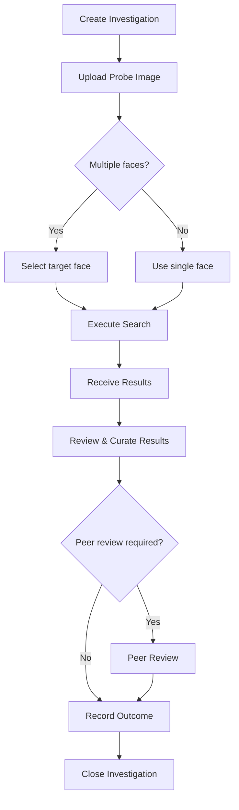

# Domain Concepts — Clearview AI

> Clearview AI is a facial recognition platform that provides law-enforcement, government, and public-safety agencies with the ability to search a probe image against a database of 70 billion+ facial images sourced from the public internet. The system exposes a RESTful JSON API (v1) at `https://app.clearview.ai/api/v1`. Core capabilities include face searches, investigation management, private galleries (watchlists), secure (ephemeral) searches, search-result curation, user/organisation administration, and data exports. This document captures the domain vocabulary, operations, processes, and constraints derived from the official Clearview API documentation (version 1.0.0).

---

## Terms

### Authentication & Identity

#### API Key

| Field | Value |
|-------|-------|
| **Definition** | A bearer token passed in the `Authorization` header to authenticate every API request. |
| **Type** | Value Object |
| **Usage** | `Authorization: Bearer <your_api_key>` |

#### User

| Field | Value |
|-------|-------|
| **Definition** | A human account within an Organisation that can perform searches, manage investigations, and administer resources. |
| **Type** | Entity |
| **Key Attributes** | See field table below. |
| **Relationships** | Belongs to a Company; member of zero or more UserGroups; owns Investigations, SearchHistoryItems, GalleryItems. |
| **Aliases** | Agent, Investigator |

| Field | Type | Description |
|-------|------|-------------|
| `user_id` | uuid v4 | Unique identifier |
| `email` | string | Login email |
| `name` | string | Full name |
| `phone_number` | string | E.164 phone number |
| `title` | string | Occupation/title |
| `role_type` | integer (enum 0,1,4,5) | Permission level |
| `suspended` | number | 0 = active; non-zero = suspended |
| `verified` | boolean | Email verification status |
| `phone_verified` | boolean | Phone verification status |
| `preferred_2fa_method` | string (email, sms, totp) | Two-factor method preference |
| `last_login_ts` | unix timestamp | Last login |
| `last_search_ts` | unix timestamp | Last face search |
| `search_count_queried` | number | Total searches performed |
| `feature_hierarchy` | string | Resolved feature-flag hierarchy |
| `gallery_coalition_contact` | boolean | Designated coalition contact |
| `owner_proxy_id` | uuid v4 | Proxy identity for ownership resolution |
| `owner_proxy_kind` | string | Proxy type (user, group, organisation) |
| `user_groups` | array of UserGroup | Groups the user belongs to |
| `disabled_app_notifications` | array of string | Suppressed in-app notifications |
| `disabled_email_notifications` | array of string | Suppressed email notifications |
| `ar_passphrase` | string | AR integration passphrase |
| `banner_text` | string | Custom banner shown in the UI |
| `needs_to_setup_2fa_method` | string | Pending 2FA setup indicator |
| `opened_by_me_count` | number | Investigations opened by this user |
| `popup_actions` | object | Accepted pop-up actions (TOS, etc.) |
| `totp_setup` | string | TOTP setup state |
| `ts` | unix timestamp | Creation timestamp |
| `user_email_change_count` | string | Number of email changes |

#### UserGroup

| Field | Value |
|-------|-------|
| **Definition** | A named subset of Users within an Organisation used to scope resource visibility and investigation sharing. |
| **Type** | Entity |

| Field | Type | Description |
|-------|------|-------------|
| `user_group_id` | uuid v4 | Unique identifier |
| `name` | string | Group name |
| `investigation_sharing` | boolean | Whether members share investigations |

#### Company (Organisation)

| Field | Value |
|-------|-------|
| **Definition** | The top-level organisational entity that owns users, licences, galleries, and policies. |
| **Type** | Aggregate Root |
| **Aliases** | Organisation, Org |

| Field | Type | Description |
|-------|------|-------------|
| `company_id` | uuid v4 | Unique identifier |
| `name` | string | Organisation name |
| `domain` | string | Primary email domain |
| `domains` | array of string | Allowed email domains |
| `country` | string | Country |
| `state` | string | State/province |
| `company_type` | integer | Organisation classification |
| `organization_type` | string | Type label |
| `industry` | string | Industry classification |
| `occupied_seats` | number | Number of active user seats |
| `early_access` | boolean | Early-access feature flag |
| `investigation_sharing` | boolean | Org-wide investigation sharing |
| `require_investigation_outcome` | boolean | Forces outcome recording on investigations |
| `has_purge` | boolean | Data purge capability enabled |
| `has_peer_review` | boolean | Peer review workflow enabled |
| `available_features` | string | Feature string |
| `feature_overrides` | object | Per-org feature flag overrides |
| `feature_hierarchy` | string | Resolved feature hierarchy |
| `banner_text` | string | Organisation-wide banner text |
| `enrollment_flow` | string | Investigation enrollment configuration |
| `configurable_schema_id` | uuid v4 | Schema used for probe-enrollment forms |
| `configurable_probe_enrollment_schema` | ConfigurableSchema | Probe enrollment schema definition |
| `coalitions` | array of Coalition | Cross-org gallery coalitions |
| `company_sso` | CompanySSO | SSO configuration (SAML/OAuth) |
| `owner_proxy_id` | uuid v4 | Proxy identity |
| `owner_proxy_kind` | string | Proxy type |
| `ts` | unix timestamp | Creation timestamp |

#### CompanySSO

| Field | Value |
|-------|-------|
| **Definition** | Single Sign-On configuration for an Organisation, supporting SAML 2.0 and OAuth 2.0. |
| **Type** | Value Object |

| Field | Type | Description |
|-------|------|-------------|
| `company_sso_id` | uuid v4 | Unique identifier |
| `company_id` | uuid v4 | Owning organisation |
| `sso_type` | string | Protocol type |
| `active` | boolean | Whether SSO is active |
| `redirect_uri` | string | OAuth redirect URI |
| `configuration_error` | string | SSO config error message |
| `saml_settings` | object | SAML configuration |
| `saml_idp_xml_metadata` | string | SAML IdP metadata XML |
| `saml_idp_entity_id` | string | IdP entity identifier |
| `saml_idp_sls_url` | string | SAML Single Logout URL |
| `saml_idp_sso_url` | string | SAML SSO URL |
| `saml_idp_x509_cert` | string | IdP X.509 certificate |
| `sp_entity_id` | string | Service Provider entity ID |
| `oauth_authorization_url` | string | OAuth authorization endpoint |
| `oauth_token_url` | string | OAuth token endpoint |
| `oauth_resource_url` | string | OAuth resource endpoint |
| `oauth_client_id` | string | OAuth client ID |
| `oauth_client_secret` | string | OAuth client secret |
| `oauth_scope` | string | OAuth scope |
| `oauth_state` | string | OAuth state parameter |
| `oauth_parameters` | object | Additional OAuth parameters |
| `oauth_use_authorization_bearer` | boolean | Use bearer token auth |

#### Coalition

| Field | Value |
|-------|-------|
| **Definition** | A cross-organisation partnership that allows gallery sharing between member organisations. |
| **Type** | Entity |

| Field | Type | Description |
|-------|------|-------------|
| `coalition_id` | uuid v4 | Unique identifier |
| `name` | string | Coalition name |
| `owner_proxy_id` | uuid v4 | Proxy identity |
| `owner_proxy_kind` | string | Proxy type |
| `ts` | unix timestamp | Creation timestamp |

---

### Search Domain

#### Search

| Field | Value |
|-------|-------|
| **Definition** | The core operation of submitting a probe image (or face reference) against Clearview's database to find visually similar faces. A search can be initiated via file upload, URL, face_id, search_history_id, or vector. |
| **Type** | Operation / Event |
| **Relationships** | Produces SearchResults; creates a SearchHistoryItem; optionally belongs to an Investigation. |

#### SearchInput

| Field | Value |
|-------|-------|
| **Definition** | The payload that describes what to search for and how. |
| **Type** | Value Object |

| Field | Type | Description |
|-------|------|-------------|
| `input.items` | array (1 item) | Search items — currently single item |
| `input.items[].type` | string | Input type: `url`, `face_id`, `search_history_id`, `file` |
| `input.items[].url` | string | Image URL (when type = url) |
| `input.items[].face_id` | uuid v4 | Face identifier (when type = face_id) |
| `input.items[].blob_id` | uuid v4 | Blob reference (when type = face_id) |
| `input.items[].face_type` | string | Source: `upload`, `camera`, `checkin`, `main_index`, `gallery`, `collection` |
| `input.items[].search_history_id` | uuid v4 | Previous search to retrigger |
| `metadata.search_name` | string | Human-readable label |
| `metadata.search_origin` | string | Origin context (e.g., `face_search`) |
| `sources` | object | Controls which indexes to search |
| `sources.main_index` | boolean / object | Search the main 70B+ image index, with optional `include_types`, `exclude_domains` |
| `sources.galleries` | boolean / object | Search private galleries, with optional `include_ids`, `exclude_ids` |
| `sources.collections` | boolean / object | Search named collections, with optional `include_ids` |
| `sources.search_connections` | object | Search federated partner connections |
| `options` | object | Additional search modifiers |

#### SecureSearch

| Field | Value |
|-------|-------|
| **Definition** | An ephemeral search that does not create a SearchHistoryItem. Results are returned inline and not persisted. An optional `custom_log_id` can record minimal metadata for auditing. |
| **Type** | Operation |
| **Relationships** | Produces SearchResults without persistence. Can optionally log to CustomLog. |

| Field | Type | Description |
|-------|------|-------------|
| `type` | string (required) | Value: `file` |
| `face_type` | string (required) | Source type (e.g., `upload`) |
| `file` | binary | The probe image |
| `search_mode` | string | `fast` (default) or `exhaustive` |
| `custom_log_id` | string | Optional audit token |

#### SearchResult

| Field | Value |
|-------|-------|
| **Definition** | A single matched face returned from a search. Contains the matched image, its web source metadata, face similarity scores, and optional gallery/collection/connection context. |
| **Type** | Entity |

| Field | Type | Description |
|-------|------|-------------|
| `search_result_id` | string | Unique identifier |
| `blob_id` | string | Image blob reference |
| `sensitive` | boolean | Whether the result is marked sensitive |
| `image_data` | ImageData | Image dimensions, URL, timestamps, MD5 |
| `link_data` | LinkData | Source web link, title, description, type |
| `profile_data` | ProfileData | Name, bio, handle, link from source profile |
| `collection_details` | CollectionDetails | Collection ID and version if from a collection |
| `collection_data` | object | Collection-specific metadata |
| `match_data` | MatchData | Similarity scores, face geometry |
| `gallery_data` | GalleryData | Gallery item context if from a private gallery |
| `search_connection_data` | SearchConnectionData | Federated connection context |

#### ImageData

| Field | Type | Description |
|-------|------|-------------|
| `width` | integer | Image width in pixels |
| `height` | integer | Image height in pixels |
| `original_image_url` | string | Original source URL |
| `image_url` | string | Clearview-hosted image URL |
| `ts` | unix timestamp | Image timestamp |
| `md5` | string | MD5 hash of image |
| `bblob_start_offset` | integer | Blob start offset |
| `bblob_end_offset` | integer | Blob end offset |

#### LinkData

| Field | Type | Description |
|-------|------|-------------|
| `link` | string | Source web URL |
| `raw_id` | string | Raw identifier at source |
| `title` | string | Page/post title |
| `description` | string | Page/post description |
| `link_type` | string | Source type classification |
| `alt_text` | string | Image alt text |

#### ProfileData

| Field | Type | Description |
|-------|------|-------------|
| `name` | string | Name from source profile |
| `bio` | string | Bio text |
| `handle` | string | Username/handle |
| `link` | string | Profile URL |

#### MatchData

| Field | Type | Description |
|-------|------|-------------|
| `sim` | number | Similarity score |
| `group` | number | Group identifier |
| `group_sim` | number | Group similarity score |
| `dist` | number | Distance metric |
| `rect` | array of number | Face bounding-box coordinates |
| `fqa_score` | number | Face Quality Assessment score |
| `num_faces` | integer | Number of faces detected |
| `face_id` | string | Face identifier |
| `face_type` | string | Face source type |

#### GalleryData

| Field | Type | Description |
|-------|------|-------------|
| `gallery_id` | integer | Gallery identifier |
| `gallery_item_id` | integer | Gallery item identifier |
| `gallery_name` | string | Gallery name |
| `is_coalition` | boolean | Whether from a shared coalition gallery |
| `tags` | array of string | Associated tags |
| `properties` | array of string | Associated properties |

#### SearchConnectionData

| Field | Type | Description |
|-------|------|-------------|
| `outbound_search_connection_id` | string | Connection identifier |
| `name` | string | Connection name |
| `description` | string | Connection description |

#### SearchHistoryItem

| Field | Value |
|-------|-------|
| **Definition** | A persistent record of a search execution. Links the probe image/face to the investigation, captures stats, and supports alerts for new matches over time. |
| **Type** | Entity |

| Field | Type | Description |
|-------|------|-------------|
| `search_history_id` | uuid v4 | Unique identifier |
| `investigation_id` | uuid v4 | Owning investigation |
| `search_name` | string | Human label |
| `search_success` | boolean | Whether search succeeded |
| `ts` | unix timestamp | Search timestamp |
| `last_search_ts` | unix timestamp | Last time this search was re-run |
| `last_alert_ts` | unix timestamp | Last alert timestamp |
| `num_matches` | integer | Total matches |
| `num_similar` | integer | Total similar (lower-confidence) matches |
| `num_local_matches` | integer | Local-index matches |
| `num_local_similar` | integer | Local similar |
| `num_remote_matches` | integer | Remote/federated matches |
| `num_remote_similar` | integer | Remote similar |
| `num_gallery_matches` | integer | Gallery matches |
| `num_external_gallery_matches` | integer | External (coalition) gallery matches |
| `hidden` | boolean | Whether hidden from view |
| `hop_reason` | string | Reason for a hop (re-search) |
| `hopped_from_search_history_id` | uuid v4 | Original search that was hopped |
| `enhanced_image_id` | uuid v4 | Enhanced image reference |
| `video_import_id` | string | Video import source |
| `alerts` | boolean | Whether alert monitoring is active |
| `auth_type` | integer | Auth method used |
| `app_version` | string | Client app version |
| `device` | string | Device identifier |
| `device_type` | integer | Device classification |
| `ipaddr` | string | Client IP address |
| `user_agent` | string | Client user agent |
| `udid` | string | Unique device identifier |
| `creator_id` | uuid v4 | User who performed the search |
| `photo_source` | integer | Source type of the probe photo |
| `search_origin` | string | Origin context |
| `lat` | number | Latitude (geolocation of search) |
| `lng` | number | Longitude |
| `face` | Face | Detected face object |
| `faces_session_token` | string | Session token for face data |
| `peer_review` | PeerReview | Peer review state |
| `deconfliction_share` | DeconflictionShare | Deconfliction sharing state |
| `guest_shared_searches` | array of GuestSharedSearch | External shares of this search |
| `investigation` | InvestigationSummary | Investigation title and ID |
| `user` | UserSummary | Searching user |

#### Face

| Field | Type | Description |
|-------|------|-------------|
| `blob_id` | uuid v4 | Parent image blob |
| `face_id` | uuid v4 | Unique face identifier |
| `fqa_score` | number | Face quality assessment score |
| `blob_kind` | string | Blob classification |
| `rect` | array of string | Bounding-box coordinates |
| `size` | string | Face size classification |
| `ts` | unix timestamp | Detection timestamp |
| `url` | string | Face-crop URL |

#### PeerReview

| Field | Type | Description |
|-------|------|-------------|
| `peer_review_id` | uuid v4 | Unique identifier |
| `search_history_id` | uuid v4 | Associated search |
| `complete` | string | Completion status |
| `results_data` | object | Review results |
| `archived` | boolean | Whether archived |
| `ts` | unix timestamp | Created timestamp |
| `updated_ts` | unix timestamp | Last update |

#### DeconflictionShare

| Field | Type | Description |
|-------|------|-------------|
| `deconfliction_share_id` | uuid v4 | Unique identifier |
| `ts` | unix timestamp | Timestamp |

#### GuestSharedSearch

| Field | Type | Description |
|-------|------|-------------|
| `guest_shared_searches_id` | uuid v4 | Unique identifier |
| `search_history_id` | uuid v4 | Search reference |
| `guest_email` | string | Recipient email |
| `guest_name` | string | Recipient name |
| `sent_email` | boolean | Whether email was sent |
| `share_limit_exceeded` | boolean | Whether share limit exceeded |
| `expires_ts` | unix timestamp | Expiry timestamp |
| `revoked` | boolean | Whether revoked |
| `token` | string | Share access token |
| `ts` | unix timestamp | Created timestamp |

#### SearchUpload (Blob)

| Field | Value |
|-------|-------|
| **Definition** | An uploaded image file (probe image) stored as a binary blob. After upload the system detects faces and provides face IDs for targeted searching. |
| **Type** | Entity |

| Field | Type | Description |
|-------|------|-------------|
| `blob_id` | uuid v4 | Unique identifier |
| `upload_blob_id` | uuid v4 | Upload tracking ID |
| `blob_kind` | string | Blob classification |
| `original_filename` | string | Original file name |
| `has_original` | boolean | Whether original image is retained |
| `ts` | unix timestamp | Upload timestamp |
| `url` | string | Hosted URL |
| `errors` | array of string | Processing errors |
| `exif` | object | Extracted EXIF metadata |
| `height` | integer | Image height |
| `width` | integer | Image width |
| `investigation_id` | uuid v4 | Associated investigation |
| `pending` | boolean | Whether face detection is still processing |
| `owner` | OwnerProxy | Owning entity |
| `faces` | array of Face | Detected faces |

---

### Investigation Domain

#### Investigation

| Field | Value |
|-------|-------|
| **Definition** | A case folder that groups related searches, probe images, and outcome records. Investigations enforce enrollment forms, peer review, and outcome tracking per organisational policy. |
| **Type** | Aggregate Root |
| **Relationships** | Owns SearchHistoryItems; has an Owner (User, UserGroup, or Organisation); has Policies; has InvestigationFeedback. |

| Field | Type | Description |
|-------|------|-------------|
| `investigation_id` | uuid v4 | Unique identifier |
| `title` | string | Investigation title |
| `ts` | unix timestamp | Created timestamp |
| `updated_ts` | unix timestamp | Last updated |
| `in_progress` | boolean | Whether investigation is still open |
| `investigation_success` | boolean | Outcome: successful or not |
| `comments` | string | Investigator comments |
| `category` | string | Free-text category label |
| `creator` | UserSummary | Creating user |
| `search_history_items` | array of SearchHistoryItem | All searches within the investigation |
| `probe_enrollment_form` | ProbeEnrollmentForm | Intake form data |
| `owner` | OwnerProxy | Owning entity (user, group, or org) |
| `policies` | array of Policy | Access policies |
| `investigation_feedback` | InvestigationFeedback | Outcome feedback |

#### InvestigationFeedback

| Field | Value |
|-------|-------|
| **Definition** | Structured outcome data recorded when an investigation concludes. Captures whether the search led to identification, location, associate identification, or expanded knowledge. |
| **Type** | Value Object |

| Field | Type | Description |
|-------|------|-------------|
| `investigation_feedback_id` | uuid v4 | Unique identifier |
| `investigation_id` | uuid v4 | Parent investigation |
| `last_reviewer_user_id` | uuid v4 | Last reviewer |
| `investigation_feedback_type` | integer | Feedback classification |
| `led_to_identification` | boolean | Did the search lead to a positive ID? |
| `led_to_location` | boolean | Did the search help locate someone? |
| `led_to_associate_identification` | boolean | Did it identify an associate? |
| `expanded_knowledge` | boolean | Did it expand investigative knowledge? |
| `other_result` | string | Free-text other outcome |
| `created_ts` | unix timestamp | Created |
| `updated_ts` | unix timestamp | Last updated |

#### Policy

| Field | Type | Description |
|-------|------|-------------|
| `operation` | string | Permitted operation |
| `principal_id` | uuid v4 | Authorised principal |
| `principal_name` | string | Principal display name |
| `principal_email` | string | Principal email |
| `principal_proxy_kind` | string | Principal type |

#### ConfigurableSchema

| Field | Type | Description |
|-------|------|-------------|
| `schema_id` | uuid v4 | Unique identifier |
| `schema_type_id` | uuid v4 | Schema type reference |
| `version` | integer | Schema version |
| `name` | string | Schema name |
| `ts` | unix timestamp | Timestamp |
| `report_section_title` | string | Title used in reports |
| `configurable_schema_id` | uuid v4 | Back-reference |

---

### Gallery Domain

#### Gallery

| Field | Value |
|-------|-------|
| **Definition** | A private, organisation-owned watchlist of persons of interest. Galleries contain items (with photos and metadata) that are searchable alongside or instead of the main index. Galleries can be shared across organisations via Coalitions. |
| **Type** | Aggregate Root |
| **Relationships** | Contains GalleryItems; owned by an Organisation; can be part of Coalitions. |

| Field | Type | Description |
|-------|------|-------------|
| `gallery_id` | uuid v4 | Unique identifier |
| `name` | string | Gallery name |
| `description` | string | Gallery description |
| `configurable_schema_id` | uuid v4 | Schema for gallery item metadata |
| `configurable_schema` | ConfigurableSchema | Full schema definition |
| `ts` | unix timestamp | Created timestamp |
| `owner` | OwnerProxy | Owning entity |
| `created_by` | UserSummary | Creating user |
| `num_items` | integer | Item count |
| `item_quota` | integer | Maximum allowed items |
| `search_config` | GallerySearchConfig | Search-mode configuration |

#### GallerySearchConfig

| Field | Type | Description |
|-------|------|-------------|
| `similarity_threshold` | number | Minimum similarity score for matches |

#### GalleryItem

| Field | Value |
|-------|-------|
| **Definition** | A single person-of-interest entry within a Gallery. Contains photos, metadata fields, and tags. |
| **Type** | Entity |

| Field | Type | Description |
|-------|------|-------------|
| `gallery_item_id` | uuid v4 | Unique identifier |
| `gallery_id` | uuid v4 | Parent gallery |
| `ts` | unix timestamp | Created timestamp |
| `custom_id` | string | External/custom identifier |
| `gallery_agent_import_id` | uuid v4 | Bulk import reference |
| `values` | array of FieldValue | Dynamic metadata field values |
| `schema` | ConfigurableSchema | Schema defining the metadata fields |
| `photos` | array of GalleryPhoto | Associated photos |
| `tags` | array of GalleryTag | Associated tags |

#### FieldValue

| Field | Type | Description |
|-------|------|-------------|
| `field_id` | string | Schema field identifier |
| `value` | any | Field value |

#### GalleryPhoto

| Field | Type | Description |
|-------|------|-------------|
| `gallery_photo_id` | uuid v4 | Unique identifier |
| `blob_id` | uuid v4 | Image blob reference |
| `blob_kind` | string | Blob classification |
| `original_filename` | string | Original file name |
| `has_original` | boolean | Whether original is retained |
| `ts` | unix timestamp | Upload timestamp |
| `url` | string | Hosted URL |
| `first_face_rect` | string | Bounding box of first detected face |
| `owner` | OwnerProxy | Owning entity |
| `faces` | array of Face | Detected faces |

#### GalleryTag

| Field | Type | Description |
|-------|------|-------------|
| `gallery_tag_id` | uuid v4 | Unique identifier |
| `label` | string | Display label |
| `color` | string | Hex colour code |

---

### Jobs & Exports

#### Job

| Field | Value |
|-------|-------|
| **Definition** | A background processing task created by bulk operations (bulk gallery import, bulk search upload, data export). |
| **Type** | Entity |

| Field | Type | Description |
|-------|------|-------------|
| `job_id` | uuid v4 | Unique identifier |
| `job_type` | string | Type of job |
| `status` | string | Current status |
| `job_return` | object | Return data on completion |
| `creator_id` | uuid v4 | User who created the job |
| `params` | object | Job parameters |
| `progress` | string | Progress indicator |
| `messages` | string | Status messages |
| `created_ts` | unix timestamp | Created |
| `updated_ts` | unix timestamp | Last updated |

#### OrganisationExport

| Field | Value |
|-------|-------|
| **Definition** | A request to export all of an Organisation's data. Multiple requests can be created. Supports an `immediate` flag for priority processing. |
| **Type** | Operation |

| Field | Type | Description |
|-------|------|-------------|
| `organization_id` | string (required) | Organisation to export |
| `immediate` | boolean | Priority flag |

---

### Common Value Objects

#### OwnerProxy

| Field | Type | Description |
|-------|------|-------------|
| `owner_proxy_id` | uuid v4 | Proxy identifier |
| `owner_proxy_kind` | string | Type: user, user_group, or organisation |

#### Pagination Envelope

Every paginated list response uses a standard wrapper:

| Field | Type | Description |
|-------|------|-------------|
| `api_version` | string | API version string |
| `id` | string | Request identifier |
| `data.items` | array | Page of results |
| `data.next_page_token` | string or null | Token for next page; null = last page |
| `data.total_items` | integer | Approximate total count |

#### CustomLog

| Field | Value |
|-------|-------|
| **Definition** | Minimal audit record for secure (ephemeral) searches. Created when a `custom_log_id` is passed to the secure search endpoint. |
| **Type** | Entity |

| Field | Type | Description |
|-------|------|-------------|
| `custom_log_id` | string | Caller-supplied identifier |
| `user_id` | uuid v4 | User who performed the search |
| `action` | string | Action type |
| `ts` | unix timestamp | Timestamp |
| `user` | UserSummary | User details |

---

### Enumerations

#### role_type

| Value | Meaning |
|-------|---------|
| 0 | Standard user |
| 1 | Admin |
| 4 | Super admin |
| 5 | System-level |

#### device_type

| Value | Meaning |
|-------|---------|
| 0 | Unknown / Web |
| (other) | Mobile / API |

#### search_mode

| Value | Meaning |
|-------|---------|
| `fast` | Faster response, possibly fewer results (default) |
| `exhaustive` | Slower but more thorough |

#### face_type

| Value | Meaning |
|-------|---------|
| `upload` | User-uploaded image |
| `camera` | Live camera capture |
| `checkin` | Check-in photo |
| `main_index` | From the main database |
| `gallery` | From a private gallery |
| `collection` | From a named collection |

#### sort_order

| Value | Meaning |
|-------|---------|
| `ascending` | Ascending sort |
| `descending` | Descending sort (default) |

#### preferred_2fa_method

| Value | Meaning |
|-------|---------|
| `email` | 2FA via email |
| `sms` | 2FA via SMS |
| `totp` | 2FA via authenticator app |

---

## Operations

### Authentication

#### Check Auth Status

| Element | Value |
|---------|-------|
| **Trigger** | API call |
| **Input** | Bearer token |
| **Output** | Auth status with User, Company, enums, feature flags, licence, config |
| **Endpoint** | `GET /auth` |
| **Description** | Returns the current user's session status. When called with an API key, always returns 200. |

---

### Searches

#### Perform Face Search

| Element | Value |
|---------|-------|
| **Trigger** | API call |
| **Input** | SearchInput (file, URL, face_id, or search_history_id) with optional metadata, sources, and options |
| **Output** | Search summary: search_query, search_metadata, search_results[], remote_search_results[], local_search_results[], search_history_item |
| **Preconditions** | Valid API key; investigation exists if `investigation_id` is provided |
| **Side Effects** | Creates a SearchHistoryItem; stores the probe image as a SearchUpload |
| **Endpoint** | `POST /api/v1/searches` |

#### Perform Secure Search

| Element | Value |
|---------|-------|
| **Trigger** | API call |
| **Input** | type (file), face_type, file (binary), search_mode, optional custom_log_id |
| **Output** | Same result shape as regular search but no SearchHistoryItem created |
| **Preconditions** | Valid API key |
| **Side Effects** | If custom_log_id provided, creates a minimal CustomLog entry |
| **Endpoint** | `POST /api/v1/secure_searches` |

#### Get Secure Search Logs

| Element | Value |
|---------|-------|
| **Trigger** | API call |
| **Input** | organization_id, user_group_id, user_id |
| **Output** | Paged list of CustomLog records |
| **Endpoint** | `GET /api/v1/secure_searches` |

---

### Search Results

#### List Search Results

| Element | Value |
|---------|-------|
| **Trigger** | API call |
| **Input** | organization_id, user_group_id, user_id, search_history_id |
| **Output** | Paged list of SearchResult objects with full detail |
| **Endpoint** | `GET /api/v1/search_results` |

#### Get Search Result

| Element | Value |
|---------|-------|
| **Trigger** | API call |
| **Input** | search_result_id (path), organization_id, user_group_id, user_id |
| **Output** | Single SearchResult with search_results and remote_search_results arrays |
| **Endpoint** | `GET /api/v1/search_results/{search_result_id}` |

#### Update Search Result User Data

| Element | Value |
|---------|-------|
| **Trigger** | API call |
| **Input** | search_result_id (path); body: user_data[] with blob_id, read_ts, curation_status |
| **Output** | Updated SearchResult |
| **Description** | Sets user-specific annotations on a result (read timestamp, curation status: neutral/positive/negative) |
| **Endpoint** | `PATCH /api/v1/search_results/{search_result_id}` |

---

### Search History

#### List Search History

| Element | Value |
|---------|-------|
| **Trigger** | API call |
| **Input** | organization_id, user_group_id, user_id, investigation_id; filters: after_ts, before_ts; paging |
| **Output** | Paged list of SearchHistoryItems |
| **Endpoint** | `GET /api/v1/search_history` |

#### Get Search History Item

| Element | Value |
|---------|-------|
| **Trigger** | API call |
| **Input** | search_history_id (path) |
| **Output** | Single SearchHistoryItem |
| **Endpoint** | `GET /api/v1/search_history/{search_history_id}` |

#### Update Search History Item

| Element | Value |
|---------|-------|
| **Trigger** | API call |
| **Input** | search_history_id (path); body fields (update metadata) |
| **Output** | Updated SearchHistoryItem |
| **Endpoint** | `PATCH /api/v1/search_history/{search_history_id}` |

---

### Search Uploads

#### Upload Probe Image

| Element | Value |
|---------|-------|
| **Trigger** | API call |
| **Input** | multipart/form-data with file, optional investigation_id |
| **Output** | SearchUpload with blob_id and detected faces[] |
| **Description** | Uploads a photo and runs face detection. Returns face_id and blob_id for use in targeted face searches. |
| **Endpoint** | `POST /api/v1/search_uploads` |

#### List Search Uploads

| Element | Value |
|---------|-------|
| **Trigger** | API call |
| **Input** | Paging and filter parameters |
| **Output** | Paged list of SearchUpload objects |
| **Endpoint** | `GET /api/v1/search_uploads` |

#### Get Search Upload

| Element | Value |
|---------|-------|
| **Trigger** | API call |
| **Input** | blob_id (path) |
| **Output** | Single SearchUpload with faces, EXIF, dimensions |
| **Endpoint** | `GET /api/v1/search_uploads/{blob_id}` |

#### Delete Search Upload

| Element | Value |
|---------|-------|
| **Trigger** | API call |
| **Input** | blob_id (path) |
| **Preconditions** | Upload must not have been used in a search |
| **Description** | Removes accidental uploads. Cannot delete uploads that have search history. |
| **Endpoint** | `DELETE /api/v1/search_uploads/{blob_id}` |

#### Bulk Upload

| Element | Value |
|---------|-------|
| **Trigger** | API call |
| **Input** | multipart/form-data with investigation_id (required), files[], urls |
| **Output** | Job object for background processing |
| **Endpoint** | `POST /api/v1/search_uploads_bulk` |

---

### Faces

#### Get Faces from Blob

| Element | Value |
|---------|-------|
| **Trigger** | API call |
| **Input** | blob_id (required), result_type (main_index, gallery, collection) |
| **Output** | List of Face objects with blob_id, face_id, rect |
| **Endpoint** | `GET /api/v1/faces` |

---

### Investigations

#### Create Investigation

| Element | Value |
|---------|-------|
| **Trigger** | API call |
| **Input** | configurable_enrollment (schema_id, values[]), category, owner_id |
| **Output** | Full Investigation object |
| **Description** | Creates a case folder. Simplest usage: provide just `category`. Full enrollment forms are configurable per organisation. |
| **Endpoint** | `POST /api/v1/investigations` |

#### List Investigations

| Element | Value |
|---------|-------|
| **Trigger** | API call |
| **Input** | creator_id, organization_id, user_group_id, user_id, owner_id; filters: in_progress, investigation_success, enrollment_complete, keyword, before_ts, after_ts; sort_by |
| **Output** | Paged list of Investigation objects |
| **Endpoint** | `GET /api/v1/investigations` |

#### Get Investigation

| Element | Value |
|---------|-------|
| **Trigger** | API call |
| **Input** | investigation_id (path) |
| **Output** | Single Investigation with all related data |
| **Endpoint** | `GET /api/v1/investigations/{investigation_id}` |

#### Delete Investigation

| Element | Value |
|---------|-------|
| **Trigger** | API call |
| **Input** | investigation_id (path) |
| **Endpoint** | `DELETE /api/v1/investigations/{investigation_id}` |

#### Update Investigation

| Element | Value |
|---------|-------|
| **Trigger** | API call |
| **Input** | investigation_id (path); body with updatable fields |
| **Output** | Updated Investigation |
| **Endpoint** | `PATCH /api/v1/investigations/{investigation_id}` |

---

### Galleries

#### Create Gallery

| Element | Value |
|---------|-------|
| **Trigger** | API call |
| **Input** | name, description, configurable_schema_id, owner_id, search_config |
| **Output** | Gallery object |
| **Endpoint** | `POST /api/v1/galleries` |

#### List Galleries

| Element | Value |
|---------|-------|
| **Trigger** | API call |
| **Input** | Paging and filter parameters |
| **Output** | Paged list of Gallery objects |
| **Endpoint** | `GET /api/v1/galleries` |

#### Get Gallery

| Element | Value |
|---------|-------|
| **Trigger** | API call |
| **Input** | gallery_id (path) |
| **Output** | Single Gallery object |
| **Endpoint** | `GET /api/v1/galleries/{gallery_id}` |

#### Delete Gallery

| Element | Value |
|---------|-------|
| **Trigger** | API call |
| **Input** | gallery_id (path) |
| **Endpoint** | `DELETE /api/v1/galleries/{gallery_id}` |

#### Update Gallery

| Element | Value |
|---------|-------|
| **Trigger** | API call |
| **Input** | gallery_id (path); body with updatable fields |
| **Output** | Updated Gallery |
| **Endpoint** | `PATCH /api/v1/galleries/{gallery_id}` |

---

### Gallery Items

#### Create Gallery Item

| Element | Value |
|---------|-------|
| **Trigger** | API call |
| **Input** | gallery_id, photos[], tags[], values[], custom_id |
| **Output** | GalleryItem object |
| **Endpoint** | `POST /api/v1/gallery_items` |

#### List Gallery Items

| Element | Value |
|---------|-------|
| **Trigger** | API call |
| **Input** | gallery_id, tag_id, page_token, max_page_size, sort_by, sort_order |
| **Output** | Paged list of GalleryItem objects |
| **Endpoint** | `GET /api/v1/gallery_items` |

#### Get Gallery Item

| Element | Value |
|---------|-------|
| **Trigger** | API call |
| **Input** | gallery_item_id (path) |
| **Output** | Single GalleryItem |
| **Endpoint** | `GET /api/v1/gallery_items/{gallery_item_id}` |

#### Delete Gallery Item

| Element | Value |
|---------|-------|
| **Trigger** | API call |
| **Input** | gallery_item_id (path) |
| **Endpoint** | `DELETE /api/v1/gallery_items/{gallery_item_id}` |

#### Update Gallery Item

| Element | Value |
|---------|-------|
| **Trigger** | API call |
| **Input** | gallery_item_id (path); body: tags[], photos[], values[] |
| **Output** | Updated GalleryItem |
| **Endpoint** | `PATCH /api/v1/gallery_items/{gallery_item_id}` |

#### Bulk Import Gallery Items

| Element | Value |
|---------|-------|
| **Trigger** | API call |
| **Input** | multipart/form-data: gallery_id (required), files[], data[], gallery_agent_import_id |
| **Output** | Job object |
| **Description** | Create multiple gallery items at once. `data[]` is a same-length array of JSON values associated one-to-one with `files[]`. |
| **Endpoint** | `POST /api/v1/gallery_items_bulk` |

---

### Gallery Photos

#### Upload Gallery Photo

| Element | Value |
|---------|-------|
| **Trigger** | API call |
| **Input** | multipart/form-data: file (binary), search_history_id, lat, lng |
| **Output** | GalleryPhoto object with faces[] |
| **Endpoint** | `POST /api/v1/gallery_photos` |

---

### Gallery Tags

#### Create Gallery Tag

| Element | Value |
|---------|-------|
| **Trigger** | API call |
| **Input** | label (required), color (required) |
| **Output** | GalleryTag object |
| **Endpoint** | `POST /api/v1/gallery_tags` |

#### List Gallery Tags

| Element | Value |
|---------|-------|
| **Trigger** | API call |
| **Input** | page_token, max_page_size, sort_by, sort_order |
| **Output** | Paged list of GalleryTag objects |
| **Endpoint** | `GET /api/v1/gallery_tags` |

---

### Organisation Exports

#### Create Organisation Export

| Element | Value |
|---------|-------|
| **Trigger** | API call |
| **Input** | organization_id (required), immediate (boolean) |
| **Description** | Requests a full data export for the organisation. Multiple export requests can coexist. |
| **Endpoint** | `POST /api/v1/organization_exports` |

---

### Users

#### List Users

| Element | Value |
|---------|-------|
| **Trigger** | API call |
| **Input** | organization_id, user_group_id, search (name/email text), format (csv), company_type, state, active, gallery_coalition_contact; paging |
| **Output** | Paged list of User objects (or CSV download) |
| **Endpoint** | `GET /api/v1/users` |

#### Get User

| Element | Value |
|---------|-------|
| **Trigger** | API call |
| **Input** | user_id (path) — or `"me"` for logged-in user |
| **Output** | Single User object |
| **Endpoint** | `GET /api/v1/users/{user_id}` |

#### Update User

| Element | Value |
|---------|-------|
| **Trigger** | API call |
| **Input** | user_id (path); body: name, title, phone_number, company_id, preferred_2fa_method, passwords, role_type, suspended, enabled_features, set_feature_override, popup_actions, banner_text, gallery_coalition_contact, totp_code, disabled notifications |
| **Output** | Updated User object |
| **Endpoint** | `PATCH /api/v1/users/{user_id}` |

---

## Processes

### Face Search Workflow

**Goal:** Identify a person by searching a probe image against Clearview's 70B+ facial image database and private galleries.

**Actors:** Investigator (User), Clearview API, Main Index, Galleries, Federated Connections

**Steps:**

1. **Create Investigation** — Investigator creates a case with a category/enrollment form (`POST /api/v1/investigations`).
2. **Upload Probe Image** — Upload the photo via `POST /api/v1/search_uploads`. The system returns a `blob_id` and detected `face_id`(s).
3. **Select Face** — If multiple faces are detected, the investigator selects the target face.
4. **Execute Search** — Submit via `POST /api/v1/searches` with `type: face_id`, `blob_id`, `face_type: upload`, and optionally source filters.
5. **Receive Results** — API returns `search_results` (main index), `local_search_results` (gallery), and `remote_search_results` (federated), plus a `search_history_item`.
6. **Review & Curate** — Investigator reviews matches, marks results via `PATCH /api/v1/search_results/{id}` (curation_status: neutral/positive/negative).
7. **Peer Review** (if enabled) — A second investigator reviews the same results.
8. **Record Outcome** — Close the investigation with feedback (led_to_identification, led_to_location, etc.) via `PATCH /api/v1/investigations/{id}`.



### Secure (Ephemeral) Search Workflow

**Goal:** Search a face without creating any persistent search history.

**Actors:** API Consumer, Clearview API

**Steps:**

1. **Submit file** via `POST /api/v1/secure_searches` with `type: file`, `face_type: upload`, and the image binary.
2. **Optionally** pass `custom_log_id` to create a minimal audit entry.
3. **Receive results** — Same structure as a normal search but no SearchHistoryItem is persisted.
4. **Retrieve logs** — If `custom_log_id` was used, retrieve via `GET /api/v1/secure_searches`.

### Gallery Management Workflow

**Goal:** Maintain a private watchlist of persons of interest.

**Actors:** Administrator, Investigator, Clearview API

**Steps:**

1. **Create Gallery** — `POST /api/v1/galleries` with name, description, optional schema.
2. **Add Items** — Individual: `POST /api/v1/gallery_items` with photos and metadata. Bulk: `POST /api/v1/gallery_items_bulk` with files and corresponding data arrays.
3. **Tag Items** — Create tags (`POST /api/v1/gallery_tags`), assign to items via `PATCH /api/v1/gallery_items/{id}`.
4. **Search Against Gallery** — In a search, set `sources.galleries: { include_ids: ["gallery_id"] }` to search only specific galleries.
5. **Manage Items** — Update (`PATCH`), delete (`DELETE`), browse (`GET` with filters).

---

## Constraints

### API Constraints

| Constraint | Description | Scope | Condition |
|------------|-------------|-------|-----------|
| Bearer Auth Required | Every request must include `Authorization: Bearer <key>` | All endpoints | Missing = 403 |
| UUID v4 Identifiers | All entity IDs are UUID v4 format | All entities | Invalid format = 400 |
| Pagination Token Validity | `page_token` is bound to the exact query that produced it; reusing across different queries is invalid | All paginated endpoints | Mismatch = undefined behaviour |
| `max_page_size` Not Guaranteed | Server may return fewer items than `max_page_size` | Paginated endpoints | Client must follow `next_page_token` |
| Single Search Item | `input.items` array currently accepts only one item | `POST /api/v1/searches` | Multiple items = rejected |
| Upload Delete Restriction | Cannot delete a SearchUpload that has been used in a search | `DELETE /api/v1/search_uploads/{blob_id}` | Used upload = 400 |
| Bulk Import 1:1 Mapping | `data[]` array length must equal `files[]` array length | `POST /api/v1/gallery_items_bulk` | Length mismatch = 400 |
| Investigation Owner Scope | `owner_id` must be the user's own proxy ID or a group they belong to | `POST /api/v1/investigations` | Invalid owner = 401/403 |
| Secure Search No History | Secure searches do not create SearchHistoryItems | `POST /api/v1/secure_searches` | By design |
| Export Duplication | Multiple export requests for the same org create separate jobs | `POST /api/v1/organization_exports` | By design |

### Standard Error Responses

| HTTP Code | Meaning |
|-----------|---------|
| 200 | Success |
| 201 | Created |
| 400 | Malformed request, validation error |
| 401 | Requester lacks permission |
| 403 | Request is unauthenticated |
| 404 | Specified resource not found |
| 500 | Server internal error |

---

## Applications

### Criminal Investigation

| Element | Value |
|---------|-------|
| **Domain Concepts** | Investigation, Search, SearchResult, PeerReview, InvestigationFeedback |
| **User Story** | As a law enforcement investigator, I upload a suspect's image so that I can find matching public web appearances and identify the individual. |
| **Behaviour** | Create investigation with case number and crime type → upload probe image → search → review results → peer review → record identification outcome → close investigation. |
| **API Surface** | `POST /api/v1/investigations`, `POST /api/v1/search_uploads`, `POST /api/v1/searches`, `GET /api/v1/search_results`, `PATCH /api/v1/search_results/{id}`, `PATCH /api/v1/investigations/{id}` |

### Watchlist Monitoring

| Element | Value |
|---------|-------|
| **Domain Concepts** | Gallery, GalleryItem, GalleryTag, Search (with gallery sources), Coalition |
| **User Story** | As a security analyst, I maintain a gallery of persons of interest so that any search automatically checks against our watchlist. |
| **Behaviour** | Create gallery → bulk-import items with photos → tag items → configure searches to include gallery sources → coalition-share with partner organisations. |
| **API Surface** | `POST /api/v1/galleries`, `POST /api/v1/gallery_items_bulk`, `POST /api/v1/gallery_tags`, `PATCH /api/v1/gallery_items/{id}`, `POST /api/v1/searches` (with `sources.galleries`) |

### Ephemeral Screening

| Element | Value |
|---------|-------|
| **Domain Concepts** | SecureSearch, CustomLog |
| **User Story** | As a compliance officer, I need to screen a face without retaining any probe images or search records in the system. |
| **Behaviour** | Submit image to secure search endpoint → receive results inline → optionally pass a custom_log_id for audit → retrieve minimal logs later. |
| **API Surface** | `POST /api/v1/secure_searches`, `GET /api/v1/secure_searches` |

### Organisation Data Export

| Element | Value |
|---------|-------|
| **Domain Concepts** | OrganisationExport, Job |
| **User Story** | As an org admin, I need to export all search and user data for compliance or data-retention purposes. |
| **Behaviour** | Request export → background job processes → export delivered. |
| **API Surface** | `POST /api/v1/organization_exports` |

### User Administration

| Element | Value |
|---------|-------|
| **Domain Concepts** | User, UserGroup, Company, CompanySSO |
| **User Story** | As an org admin, I manage user accounts, roles, 2FA settings, and feature access. |
| **Behaviour** | List users → update roles/suspension → configure features → manage SSO. |
| **API Surface** | `GET /api/v1/users`, `GET /api/v1/users/{id}`, `PATCH /api/v1/users/{id}` |

---

## Object Model

```
Company (Organisation)
├── CompanySSO
├── Coalition[]
├── ConfigurableSchema (probe enrollment)
├── UserGroup[]
│   └── User[]
├── Gallery[]
│   ├── GallerySearchConfig
│   ├── GalleryItem[]
│   │   ├── GalleryPhoto[]
│   │   │   └── Face[]
│   │   ├── GalleryTag[]
│   │   └── FieldValue[]
│   └── ConfigurableSchema
├── Investigation[]
│   ├── SearchHistoryItem[]
│   │   ├── Face
│   │   ├── PeerReview
│   │   ├── DeconflictionShare
│   │   └── GuestSharedSearch[]
│   ├── ProbeEnrollmentForm
│   ├── Policy[]
│   ├── InvestigationFeedback
│   └── OwnerProxy
└── OrganisationExport → Job

Search (transient)
├── SearchInput
│   ├── items[] (url | face_id | search_history_id | file)
│   ├── metadata
│   ├── sources (main_index, galleries, collections, search_connections)
│   └── options
└── SearchResponse
    ├── search_query
    ├── search_metadata
    ├── search_results[] → SearchResult
    │   ├── ImageData
    │   ├── LinkData
    │   ├── ProfileData
    │   ├── MatchData
    │   ├── GalleryData
    │   ├── CollectionDetails
    │   └── SearchConnectionData
    ├── local_search_results[]
    ├── remote_search_results[]
    └── search_history_item → SearchHistoryItem

SecureSearch (ephemeral, no persistence)
└── Same response as Search minus search_history_item

SearchUpload (Blob)
├── Face[]
└── OwnerProxy

Pagination Envelope (wraps all list responses)
├── api_version
├── id
└── data { items[], next_page_token, total_items }
```

---

## API Endpoint Summary

| Method | Path | Tag | Description |
|--------|------|-----|-------------|
| `GET` | `/auth` | authentication | Check auth status |
| `POST` | `/api/v1/searches` | searches | Perform face search |
| `POST` | `/api/v1/secure_searches` | secure_searches | Ephemeral face search |
| `GET` | `/api/v1/secure_searches` | secure_searches | List secure search logs |
| `GET` | `/api/v1/search_results` | search_results | List search results |
| `GET` | `/api/v1/search_results/{search_result_id}` | search_results | Get search result |
| `PATCH` | `/api/v1/search_results/{search_result_id}` | search_results | Update result user data |
| `GET` | `/api/v1/search_history` | search_history | List search history |
| `GET` | `/api/v1/search_history/{search_history_id}` | search_history | Get search history item |
| `PATCH` | `/api/v1/search_history/{search_history_id}` | search_history | Update search history item |
| `POST` | `/api/v1/search_uploads` | search_uploads | Upload probe image |
| `GET` | `/api/v1/search_uploads` | search_uploads | List uploads |
| `GET` | `/api/v1/search_uploads/{blob_id}` | search_uploads | Get upload |
| `DELETE` | `/api/v1/search_uploads/{blob_id}` | search_uploads | Delete upload |
| `POST` | `/api/v1/search_uploads_bulk` | search_uploads | Bulk upload |
| `GET` | `/api/v1/faces` | faces | Get faces from blob |
| `POST` | `/api/v1/investigations` | investigations | Create investigation |
| `GET` | `/api/v1/investigations` | investigations | List investigations |
| `GET` | `/api/v1/investigations/{investigation_id}` | investigations | Get investigation |
| `DELETE` | `/api/v1/investigations/{investigation_id}` | investigations | Delete investigation |
| `PATCH` | `/api/v1/investigations/{investigation_id}` | investigations | Update investigation |
| `POST` | `/api/v1/galleries` | galleries | Create gallery |
| `GET` | `/api/v1/galleries` | galleries | List galleries |
| `GET` | `/api/v1/galleries/{gallery_id}` | galleries | Get gallery |
| `DELETE` | `/api/v1/galleries/{gallery_id}` | galleries | Delete gallery |
| `PATCH` | `/api/v1/galleries/{gallery_id}` | galleries | Update gallery |
| `POST` | `/api/v1/gallery_items` | gallery_items | Create gallery item |
| `GET` | `/api/v1/gallery_items` | gallery_items | List gallery items |
| `GET` | `/api/v1/gallery_items/{gallery_item_id}` | gallery_items | Get gallery item |
| `DELETE` | `/api/v1/gallery_items/{gallery_item_id}` | gallery_items | Delete gallery item |
| `PATCH` | `/api/v1/gallery_items/{gallery_item_id}` | gallery_items | Update gallery item |
| `POST` | `/api/v1/gallery_items_bulk` | gallery_items | Bulk import gallery items |
| `POST` | `/api/v1/gallery_photos` | gallery_photos | Upload gallery photo |
| `POST` | `/api/v1/gallery_tags` | gallery_tags | Create gallery tag |
| `GET` | `/api/v1/gallery_tags` | gallery_tags | List gallery tags |
| `POST` | `/api/v1/organization_exports` | company_jobs | Export org data |
| `GET` | `/api/v1/users` | users | List users |
| `GET` | `/api/v1/users/{user_id}` | users | Get user |
| `PATCH` | `/api/v1/users/{user_id}` | users | Update user |
