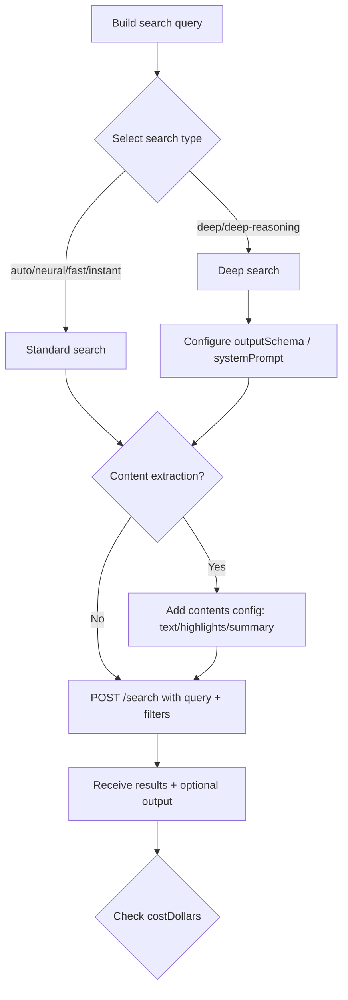
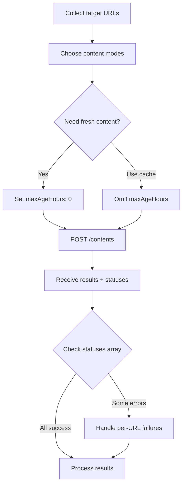

# Domain Concepts — Exa AI

> Exa AI is a custom search engine built for AI agents and applications. It exposes a RESTful JSON API at `https://api.exa.ai` with endpoints for web search, content extraction, similarity search, question answering, and asynchronous deep research. The platform indexes billions of web pages with custom data-type indexes (1B+ people, 50M+ companies, 100M+ research papers) and offers multiple search-quality tiers from instant (~200ms) to deep research (minutes). This document captures the domain vocabulary, operations, processes, and constraints derived from the official Exa API documentation.

---

## Terms

### Authentication & Configuration

#### API Key

| Field | Value |
|-------|-------|
| **Definition** | A secret token used to authenticate every API request. Passed via `x-api-key` header or `Authorization: Bearer <key>` header. |
| **Type** | Value Object |
| **Aliases** | Bearer Token |

#### CostDollars

| Field | Value |
|-------|-------|
| **Definition** | A cost breakdown object returned with every API response, reporting the dollar cost of the request. |
| **Type** | Value Object |

| Field | Type | Description |
|-------|------|-------------|
| `total` | float | Total dollar cost for the request |
| `breakDown` | array of CostBreakdownItem | Per-component cost breakdown |
| `perRequestPrices` | object | Fixed per-request price tiers |
| `perPagePrices` | object | Per-page content extraction prices |

#### CostBreakdownItem

| Field | Type | Description |
|-------|------|-------------|
| `search` | float | Search cost |
| `contents` | float | Content extraction cost |
| `breakdown.neuralSearch` | float | Neural search cost |
| `breakdown.deepSearch` | float | Deep search cost |
| `breakdown.contentText` | float | Text extraction cost |
| `breakdown.contentHighlight` | float | Highlight extraction cost |
| `breakdown.contentSummary` | float | Summary generation cost |

#### Pricing Tiers

| Price Key | Value | Description |
|-----------|-------|-------------|
| `neuralSearch_1_10_results` | $0.007 | Neural search for 1–10 results |
| `neuralSearch_additional_result` | $0.001 | Each additional result beyond 10 |
| `deepSearch` | $0.012 | Deep search per request |
| `deepReasoningSearch` | $0.015 | Deep-reasoning search per request |
| `contentText` | $0.001 | Full text per page |
| `contentHighlight` | $0.001 | Highlights per page |
| `contentSummary` | $0.001 | Summary per page |

---

### Search Domain

#### SearchType

| Field | Value |
|-------|-------|
| **Definition** | The search algorithm tier that controls the latency-quality trade-off. |
| **Type** | Enum |

| Value | Latency | Description |
|-------|---------|-------------|
| `auto` | ~1s | Default. Intelligently combines neural and other methods |
| `instant` | ~200ms | Lowest latency, optimised for real-time apps (chat, voice) |
| `fast` | ~450ms | Streamlined models, speed with minimal quality sacrifice |
| `neural` | ~1s | Embeddings-based semantic search |
| `deep` | 5–60s | Multi-step search with reasoning and structured outputs |
| `deep-reasoning` | 5–60s | Deep search with maximum reasoning capability |

#### Category

| Field | Value |
|-------|-------|
| **Definition** | A data-type filter that focuses results on a specific content vertical. Some categories impose parameter restrictions. |
| **Type** | Enum |

| Value | Index Size | Restrictions |
|-------|-----------|--------------|
| `company` | 50M+ company pages | No date filters, no text filters, no `excludeDomains` |
| `people` | 1B+ people profiles | Same as company; `includeDomains` only accepts LinkedIn domains |
| `research paper` | 100M+ papers | None |
| `news` | Current events | None |
| `personal site` | Blogs, personal pages | None |
| `financial report` | SEC filings, earnings | None |

#### SearchResult

| Field | Value |
|-------|-------|
| **Definition** | A single result returned from a search or find-similar operation, representing a matched web page with optional extracted content. |
| **Type** | Entity |

| Field | Type | Nullable | Description |
|-------|------|----------|-------------|
| `title` | string | no | Page title |
| `url` | string | no | Page URL |
| `id` | string | no | Document ID (same as URL); usable with `/contents` |
| `publishedDate` | string (ISO 8601) | yes | Estimated publication date |
| `author` | string | yes | Author if available |
| `image` | string | yes | Associated image URL |
| `favicon` | string | yes | Favicon URL for the domain |
| `text` | string | yes | Full page text as markdown (if `contents.text` requested) |
| `highlights` | string[] | yes | Key excerpts relevant to query (if `contents.highlights` requested) |
| `highlightScores` | float[] | yes | Cosine similarity scores for each highlight |
| `summary` | string | yes | LLM-generated summary (if `contents.summary` requested) |
| `subpages` | SearchResult[] | yes | Nested results from subpage crawling |
| `extras.links` | string[] | yes | Extracted hyperlinks from the page |
| `extras.imageLinks` | string[] | yes | Extracted image URLs from the page |

#### DeepOutput

| Field | Value |
|-------|-------|
| **Definition** | Synthesised output returned only for `deep` and `deep-reasoning` search types. Contains a coherent answer or structured object plus field-level citations. |
| **Type** | Value Object |

| Field | Type | Description |
|-------|------|-------------|
| `content` | string or object | Synthesised answer; string by default, structured JSON when `outputSchema` is provided |
| `grounding` | Grounding[] | Field-level citations and confidence scores |

#### Grounding

| Field | Type | Description |
|-------|------|-------------|
| `field` | string | Field path (e.g., `"content"`, `"companies[0].funding"`) |
| `citations` | Citation[] | Source references |
| `confidence` | string | `"low"`, `"medium"`, or `"high"` |

#### Citation

| Field | Type | Description |
|-------|------|-------------|
| `url` | string | Source web URL |
| `title` | string | Source page title |

---

### Content Extraction Domain

#### ContentMode

| Field | Value |
|-------|-------|
| **Definition** | The method(s) used to extract and return page content. Multiple modes can be combined in a single request. |
| **Type** | Concept |

| Mode | Description | Token Efficiency | Best For |
|------|-------------|-----------------|----------|
| `text` | Full page content as clean markdown | Standard | Deep analysis, full context research |
| `highlights` | Key excerpts selected by an LLM | 10x fewer tokens | Agent workflows, factual lookups |
| `summary` | LLM-generated abstract | Compact | Quick overviews, structured extraction |

#### TextOptions

| Field | Value |
|-------|-------|
| **Definition** | Configuration for full text extraction. Can be `true` (defaults) or an object with fine-grained settings. |
| **Type** | Value Object |

| Field | Type | Default | Description |
|-------|------|---------|-------------|
| `maxCharacters` | integer | — | Character limit for returned text |
| `includeHtmlTags` | boolean | false | Preserve HTML tags in output |
| `verbosity` | string | `"compact"` | `compact`, `standard`, or `full`; use `maxAgeHours: 0` for fresh content |
| `includeSections` | string[] | — | Only include: `header`, `navigation`, `banner`, `body`, `sidebar`, `footer`, `metadata` |
| `excludeSections` | string[] | — | Exclude specified sections |

#### HighlightsOptions

| Field | Value |
|-------|-------|
| **Definition** | Configuration for extracting key excerpts from pages. These are pulled directly from the source, not generated. |
| **Type** | Value Object |

| Field | Type | Description |
|-------|------|-------------|
| `maxCharacters` | integer | Maximum characters for all highlights combined per URL (recommended: 4000) |
| `query` | string | Custom query to direct the LLM's selection of relevant excerpts |

#### SummaryOptions

| Field | Value |
|-------|-------|
| **Definition** | Configuration for LLM-generated summaries. Supports structured output via JSON Schema. |
| **Type** | Value Object |

| Field | Type | Description |
|-------|------|-------------|
| `query` | string | Custom query for the summary |
| `schema` | object | JSON Schema (Draft 7) for structured summary output |

#### ContentFreshness

| Field | Value |
|-------|-------|
| **Definition** | Controls whether results come from cache or are freshly crawled via `maxAgeHours`. |
| **Type** | Concept |

| `maxAgeHours` Value | Behaviour |
|---------------------|-----------|
| Omitted (default) | Livecrawl only when no cached content exists |
| Positive (e.g., 24) | Use cache if < N hours old, otherwise livecrawl |
| `0` | Always livecrawl, never use cache (slowest, freshest) |
| `-1` | Never livecrawl, cache only (fastest, may be stale) |

#### ContentStatus

| Field | Value |
|-------|-------|
| **Definition** | Per-URL status information returned in the `/contents` response `statuses` array. |
| **Type** | Value Object |

| Field | Type | Description |
|-------|------|-------------|
| `id` | string | The requested URL |
| `status` | string | `"success"` or `"error"` |
| `error.tag` | string | Error type: `CRAWL_NOT_FOUND`, `CRAWL_TIMEOUT`, `CRAWL_LIVECRAWL_TIMEOUT`, `SOURCE_NOT_AVAILABLE`, `UNSUPPORTED_URL`, `CRAWL_UNKNOWN_ERROR` |
| `error.httpStatusCode` | integer | Corresponding HTTP status code (404, 504, 403, 500+) |

---

### Answer Domain

#### Answer

| Field | Value |
|-------|-------|
| **Definition** | An LLM-generated response to a question, informed by Exa search results. Can be a direct factual answer or a detailed summary with citations. Supports structured output via `outputSchema`. |
| **Type** | Value Object |

| Field | Type | Description |
|-------|------|-------------|
| `answer` | string or object | The generated answer; string by default, structured JSON when `outputSchema` is provided |
| `citations` | AnswerCitation[] | Search results used to generate the answer |
| `costDollars` | CostDollars | Cost breakdown |

#### AnswerCitation

| Field | Type | Description |
|-------|------|-------------|
| `id` | string | Document ID (URL) |
| `url` | string | Source page URL |
| `title` | string | Page title |
| `author` | string | Author if available |
| `publishedDate` | string | Publication date |
| `text` | string | Page text (if `text: true` requested) |
| `image` | string | Image URL |
| `favicon` | string | Favicon URL |

---

### Research Domain

#### ResearchTask

| Field | Value |
|-------|-------|
| **Definition** | An asynchronous deep research task that explores the web, gathers sources, synthesises findings, and returns results with citations. Operates asynchronously — the API returns a `researchId` for polling. |
| **Type** | Entity |

| Field | Type | Description |
|-------|------|-------------|
| `researchId` | string | Unique identifier for tracking |
| `createdAt` | number | Unix timestamp in milliseconds |
| `instructions` | string | Original research instructions (max 4096 chars) |
| `status` | ResearchStatus | Current task state |
| `model` | ResearchModel | Model used for the task |
| `outputSchema` | object | JSON Schema for structured output (optional) |
| `output` | string or object | Research results (when completed) |
| `sources` | object[] | Sources referenced (when completed) |
| `events` | object[] | Detailed event log (when `events=true` query param) |

#### ResearchStatus

| Value | Description |
|-------|-------------|
| `pending` | Task created, not yet started |
| `running` | Task is actively researching |
| `completed` | Task finished successfully |
| `canceled` | Task was cancelled |
| `failed` | Task encountered an error |

#### ResearchModel

| Value | Description |
|-------|-------------|
| `exa-research-fast` | Fastest, lower cost |
| `exa-research` | Default, good balance |
| `exa-research-pro` | Most thorough analysis and strongest reasoning |

---

## Operations

### Search

| Element | Description |
|---------|-------------|
| **Trigger** | `POST https://api.exa.ai/search` |
| **Description** | Search the web using natural language queries. Returns matching pages with optional content extraction. Supports multiple search types, categories, domain/date/text filters, deep search with structured outputs, and inline content retrieval. |

**Request Parameters:**

| Field | Type | Required | Default | Description |
|-------|------|----------|---------|-------------|
| `query` | string | yes | — | Natural language search query |
| `type` | SearchType | no | `"auto"` | Search algorithm tier |
| `category` | Category | no | — | Data-type filter |
| `numResults` | integer | no | 10 | Number of results (1–100) |
| `userLocation` | string | no | — | ISO country code (e.g., `"US"`) |
| `includeDomains` | string[] | no | — | Only return from these domains (max 1200) |
| `excludeDomains` | string[] | no | — | Exclude these domains (max 1200) |
| `startPublishedDate` | string (ISO 8601) | no | — | Links published after this date |
| `endPublishedDate` | string (ISO 8601) | no | — | Links published before this date |
| `startCrawlDate` | string (ISO 8601) | no | — | Links crawled after this date |
| `endCrawlDate` | string (ISO 8601) | no | — | Links crawled before this date |
| `includeText` | string[] | no | — | Must appear in results (max 1 string, 5 words) |
| `excludeText` | string[] | no | — | Must not appear in results (max 1 string, 5 words; checks first 1000 words) |
| `moderation` | boolean | no | false | Filter unsafe content |
| `additionalQueries` | string[] | no | — | Extra queries for deep search only |
| `systemPrompt` | string | no | — | Deep-search instructions for search planning and synthesis |
| `outputSchema` | object | no | — | JSON Schema for structured `output.content` (deep search only; max nesting depth 2, max 10 properties) |
| `contents` | ContentsObject | no | — | Inline content extraction configuration |

**Contents Object (nested under `contents` on `/search`):**

| Field | Type | Default | Description |
|-------|------|---------|-------------|
| `text` | boolean or TextOptions | — | Full page text as markdown |
| `highlights` | boolean or HighlightsOptions | — | Key excerpts |
| `summary` | boolean or SummaryOptions | — | LLM-generated summary |
| `livecrawlTimeout` | integer | 10000 | Livecrawl timeout in ms |
| `maxAgeHours` | integer | — | Cache freshness control |
| `subpages` | integer | 0 | Number of subpages to crawl per result |
| `subpageTarget` | string or string[] | — | Keywords to prioritise for subpage selection |
| `extras.links` | integer | 0 | Number of URLs to extract per page |
| `extras.imageLinks` | integer | 0 | Number of image URLs to extract per page |

**Response:**

| Field | Type | Description |
|-------|------|-------------|
| `requestId` | string | Unique request identifier |
| `searchType` | string | Which search type was used (for `auto` queries) |
| `results` | SearchResult[] | List of matched pages |
| `output` | DeepOutput | Synthesised output (deep search only) |
| `costDollars` | CostDollars | Cost breakdown |

---

### Get Contents

| Element | Description |
|---------|-------------|
| **Trigger** | `POST https://api.exa.ai/contents` |
| **Description** | Extract clean, LLM-ready content from any URLs. Handles JS-rendered pages, PDFs, and complex layouts. Returns text, highlights, summaries, or all three. Content modes are **top-level** parameters on this endpoint (not nested under `contents`). |

**Request Parameters:**

| Field | Type | Required | Default | Description |
|-------|------|----------|---------|-------------|
| `urls` | string[] | yes | — | Array of URLs to extract content from |
| `ids` | string[] | no | — | Alias for `urls` (backward compatible) |
| `text` | boolean or TextOptions | no | — | Full page text |
| `highlights` | boolean or HighlightsOptions | no | — | Key excerpts |
| `summary` | boolean or SummaryOptions | no | — | LLM summary |
| `maxAgeHours` | integer | no | — | Cache freshness control |
| `livecrawlTimeout` | integer | no | 10000 | Livecrawl timeout in ms |
| `subpages` | integer | no | 0 | Number of subpages to crawl per URL |
| `subpageTarget` | string or string[] | no | — | Keywords for subpage selection |
| `extras.links` | integer | no | 0 | URLs to extract per page |
| `extras.imageLinks` | integer | no | 0 | Image URLs to extract per page |

**Response:**

| Field | Type | Description |
|-------|------|-------------|
| `requestId` | string | Unique request identifier |
| `results` | SearchResult[] | List of content results |
| `statuses` | ContentStatus[] | Per-URL status (always check for errors) |
| `costDollars` | CostDollars | Cost breakdown |

> **Important:** The endpoint returns HTTP 200 even when individual URLs fail. Per-URL errors appear in the `statuses` array.

---

### Find Similar Links

| Element | Description |
|---------|-------------|
| **Trigger** | `POST https://api.exa.ai/findSimilar` |
| **Description** | Find web pages similar to a given URL. Accepts the same filtering and content options as Search (except `query` is replaced by `url`). |

**Request Parameters:**

| Field | Type | Required | Default | Description |
|-------|------|----------|---------|-------------|
| `url` | string | yes | — | The URL to find similar pages for |
| `numResults` | integer | no | 10 | Number of results (1–100) |
| `includeDomains` | string[] | no | — | Domain allowlist (max 1200) |
| `excludeDomains` | string[] | no | — | Domain blocklist (max 1200) |
| `startPublishedDate` | string | no | — | Published after (ISO 8601) |
| `endPublishedDate` | string | no | — | Published before (ISO 8601) |
| `startCrawlDate` | string | no | — | Crawled after (ISO 8601) |
| `endCrawlDate` | string | no | — | Crawled before (ISO 8601) |
| `includeText` | string[] | no | — | Required text (max 1 string, 5 words) |
| `excludeText` | string[] | no | — | Excluded text (max 1 string, 5 words) |
| `moderation` | boolean | no | false | Content moderation |
| `contents` | ContentsObject | no | — | Content extraction configuration |

**Response:** Same shape as Search response (without `output` and `searchType`).

---

### Answer

| Element | Description |
|---------|-------------|
| **Trigger** | `POST https://api.exa.ai/answer` |
| **Description** | Get an LLM answer to a question informed by Exa search results. Produces a direct answer for specific queries or a detailed summary with citations for open-ended queries. Supports streaming via SSE and structured output via `outputSchema`. |

**Request Parameters:**

| Field | Type | Required | Default | Description |
|-------|------|----------|---------|-------------|
| `query` | string | yes | — | The question to answer (min length: 1) |
| `stream` | boolean | no | false | Return response as SSE stream |
| `text` | boolean | no | false | Include full text in citations |
| `outputSchema` | object | no | — | JSON Schema (Draft 7) for structured answer |

**Response:**

| Field | Type | Description |
|-------|------|-------------|
| `answer` | string or object | Generated answer |
| `citations` | AnswerCitation[] | Sources used |
| `costDollars` | CostDollars | Cost breakdown |

---

### Create Research Task

| Element | Description |
|---------|-------------|
| **Trigger** | `POST https://api.exa.ai/research/v1` |
| **Description** | Create an asynchronous research task that explores the web, gathers sources, synthesises findings, and returns results with citations. Returns immediately with a `researchId` for polling. |

**Request Parameters:**

| Field | Type | Required | Default | Description |
|-------|------|----------|---------|-------------|
| `instructions` | string | yes | — | Research instructions (max 4096 chars) |
| `model` | ResearchModel | no | `"exa-research"` | Research model tier |
| `outputSchema` | object | no | — | JSON Schema for structured output |

**Response (201):** ResearchTask object with status `"pending"` or `"running"`.

---

### Get Research Task

| Element | Description |
|---------|-------------|
| **Trigger** | `GET https://api.exa.ai/research/v1/{researchId}` |
| **Description** | Retrieve the status and results of a previously created research task. Poll until `status` is `"completed"`, `"canceled"`, or `"failed"`. |

**Query Parameters:**

| Field | Type | Description |
|-------|------|-------------|
| `stream` | string | `"true"` for real-time SSE updates |
| `events` | string | `"true"` to include detailed event log |

**Response (200):** Full ResearchTask object with `output` and `sources` when completed.

---

### List Research Tasks

| Element | Description |
|---------|-------------|
| **Trigger** | `GET https://api.exa.ai/research/v1` |
| **Description** | Retrieve a paginated list of research tasks ordered by creation time (newest first). |

**Query Parameters:**

| Field | Type | Default | Description |
|-------|------|---------|-------------|
| `cursor` | string | — | Pagination cursor |
| `limit` | integer | 10 | Results per page (1–50) |

**Response (200):**

| Field | Type | Description |
|-------|------|-------------|
| `data` | ResearchTask[] | List of research tasks |
| `hasMore` | boolean | Whether more results exist |
| `nextCursor` | string or null | Cursor for next page |

---

## Processes

### Basic Search with Content Extraction



### Content Extraction from Known URLs



### Asynchronous Research Workflow

```mermaid
flowchart TD
    A[Define research instructions] --> B[POST /research/v1]
    B --> C[Receive researchId + status: pending/running]
    C --> D[Poll: GET /research/v1/{researchId}]
    D --> E{Check status}
    E -->|pending/running| F[Wait and retry]
    F --> D
    E -->|completed| G[Extract output + sources]
    E -->|failed| H[Handle error]
    E -->|canceled| I[Task was cancelled]
```

---

## Constraints

### Request Constraints

| Constraint | Scope | Condition | Violation |
|------------|-------|-----------|-----------|
| Max results | Search, FindSimilar | `numResults` ≤ 100 | 400 error |
| Include domains limit | Search, FindSimilar | `includeDomains` array ≤ 1200 | 400 error |
| Exclude domains limit | Search, FindSimilar | `excludeDomains` array ≤ 1200 | 400 error |
| Include text limit | Search, FindSimilar | Max 1 string, up to 5 words | 400 error |
| Exclude text limit | Search, FindSimilar | Max 1 string, up to 5 words; checks first 1000 words | 400 error |
| Query min length | Answer | `query` min length: 1 | 422 error |
| Research instructions | Create Task | `instructions` max 4096 chars | 400 error |
| Research list limit | List Tasks | `limit` 1–50 | 400 error |
| Output schema depth | Search (deep) | Max nesting depth: 2, max properties: 10 | 422 error |

### Category Filter Restrictions

| Constraint | Category | Unsupported Parameters |
|------------|----------|----------------------|
| No date filters | `company`, `people` | `startPublishedDate`, `endPublishedDate`, `startCrawlDate`, `endCrawlDate` |
| No text filters | `company`, `people` | `includeText`, `excludeText` |
| No domain exclusion | `company`, `people` | `excludeDomains` |
| LinkedIn-only domains | `people` | `includeDomains` only accepts LinkedIn domains |

### Content Nesting Rules

| Constraint | Scope | Rule |
|------------|-------|------|
| Search endpoint | `POST /search` | `text`, `highlights`, `summary` MUST be nested inside `contents` object |
| Contents endpoint | `POST /contents` | `text`, `highlights`, `summary` are TOP-LEVEL parameters (NOT nested in `contents`) |

### Error Codes

| Code | Description |
|------|-------------|
| 400 | Bad request — invalid parameters, unsupported filter for category |
| 401 | Invalid or missing API key |
| 422 | Validation error — check parameter types and constraints |
| 429 | Rate limit exceeded |
| 500 | Internal server error |

### Per-URL Error Tags (Contents)

| Tag | HTTP Code | Description |
|-----|-----------|-------------|
| `CRAWL_NOT_FOUND` | 404 | Content not found |
| `CRAWL_TIMEOUT` | 504 | Crawl timed out |
| `CRAWL_LIVECRAWL_TIMEOUT` | 504 | Livecrawl exceeded timeout |
| `SOURCE_NOT_AVAILABLE` | 403 | Access forbidden |
| `UNSUPPORTED_URL` | — | URL type not supported |
| `CRAWL_UNKNOWN_ERROR` | 500+ | Other errors |

---

## Applications

### Web Search Tool for AI Agents

| Element | Description |
|---------|-------------|
| **Domain Concepts** | Search, SearchType(`auto`), ContentMode(`highlights`), SearchResult |
| **User Story** | As an AI agent builder, I give my agent web search so that it can answer questions with up-to-date information |
| **Behaviour** | Agent calls `POST /search` with a natural-language query, `type: "auto"`, and `contents.highlights.maxCharacters: 4000` to get token-efficient results |
| **API Surface** | `POST /search` |

### Data Enrichment / Structured Extraction

| Element | Description |
|---------|-------------|
| **Domain Concepts** | Search, SearchType(`deep`), DeepOutput, OutputSchema, Grounding |
| **User Story** | As a data analyst, I extract structured data from the web so I can populate databases without manual research |
| **Behaviour** | Call `POST /search` with `type: "deep"`, a `systemPrompt` for guidance, and an `outputSchema` defining the desired JSON structure. The response `output.content` contains structured data with `output.grounding` providing field-level citations |
| **API Surface** | `POST /search` |

### Company / People Research

| Element | Description |
|---------|-------------|
| **Domain Concepts** | Search, Category(`company`, `people`), SearchResult, ContentMode |
| **User Story** | As a researcher, I find companies and people matching specific criteria so I can build targeted lists |
| **Behaviour** | Call `POST /search` with `category: "company"` or `category: "people"` and relevant query. Note: date/text filters are not supported for these categories |
| **API Surface** | `POST /search` |

### Similar Page Discovery

| Element | Description |
|---------|-------------|
| **Domain Concepts** | FindSimilar, SearchResult, ContentMode |
| **User Story** | As a content curator, I find pages similar to a known good source so I can expand my reading list |
| **Behaviour** | Call `POST /findSimilar` with the seed `url` plus optional domain/date/text filters and content extraction |
| **API Surface** | `POST /findSimilar` |

### Question Answering with Citations

| Element | Description |
|---------|-------------|
| **Domain Concepts** | Answer, AnswerCitation, OutputSchema |
| **User Story** | As a chatbot developer, I provide grounded answers to user questions so that responses are factual and verifiable |
| **Behaviour** | Call `POST /answer` with the question as `query`. The response includes an `answer` string plus `citations` with source URLs. Supports streaming (`stream: true`) and structured output (`outputSchema`) |
| **API Surface** | `POST /answer` |

### Deep Research Reports

| Element | Description |
|---------|-------------|
| **Domain Concepts** | ResearchTask, ResearchModel, ResearchStatus |
| **User Story** | As an analyst, I commission a thorough research report on a topic so I get a comprehensive synthesis with sources |
| **Behaviour** | Create task via `POST /research/v1`, poll via `GET /research/v1/{researchId}` until completed, then extract `output` and `sources`. Supports `exa-research-fast`, `exa-research`, and `exa-research-pro` models |
| **API Surface** | `POST /research/v1`, `GET /research/v1/{researchId}`, `GET /research/v1` |
