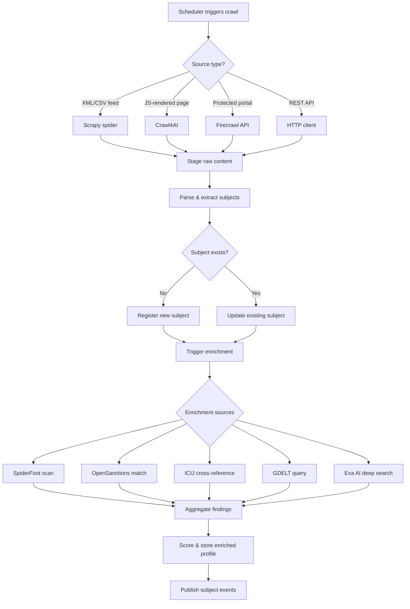
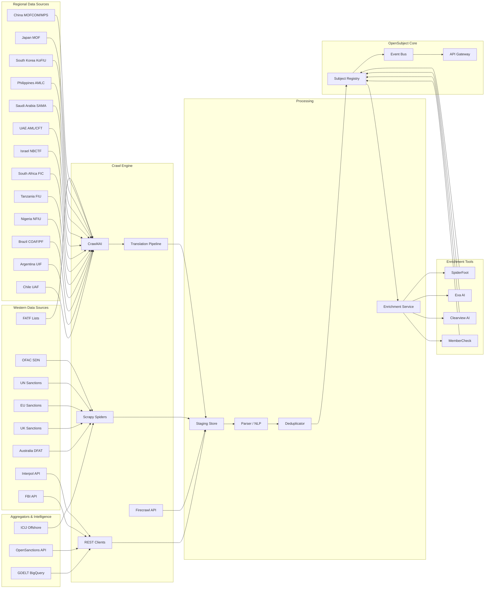

# Domain Concepts — Intelligent Crawling & OSINT Data Acquisition

> This document defines the crawling tools, government data feeds, and open-source intelligence (OSINT) aggregation platforms that OpenSubject integrates to continuously ingest, monitor, and enrich threat-related subject data from worldwide sources. It forms the acquisition backbone supporting BS-1 (Ingest Government Notices), BS-5 (Continuous Monitoring), and other business scenarios requiring automated collection from open intelligence sources.

---

## Terms

### Crawling Tools

#### Crawl4AI

| Field | Value |
|-------|-------|
| **Definition** | Open-source, LLM-friendly web crawler that converts web pages into clean markdown, structured data, and media for RAG pipelines and AI agents. |
| **Type** | Tool — Web Crawler |
| **License** | Apache 2.0 |
| **Language** | Python |
| **Repository** | `https://github.com/unclecode/crawl4ai` (63.3k ★) |
| **Version** | 0.8.6 |

**Key Capabilities:**

| Capability | Description |
|-----------|-------------|
| Async Crawling | High-performance asynchronous architecture for concurrent page fetching |
| Deep Crawl (BFS) | Breadth-first deep crawl with configurable depth, domain scoping, and URL filtering |
| Anti-Bot Detection | 3-tier system: stealth browser → managed browser → proxy escalation |
| Shadow DOM Flattening | Extracts content hidden inside Shadow DOM components |
| JS Rendering | Full JavaScript execution via headless browser for dynamic content |
| LLM Extraction | Structured data extraction using LLM providers (OpenAI, Ollama, etc.) with schema definitions |
| Markdown Output | Converts pages to clean markdown optimised for LLM consumption |
| Docker Deployment | Production-ready Docker images for self-hosted deployment |
| CLI (`crwl`) | Command-line interface for scripting and automation |
| Prefetch Mode | 5–10× faster URL discovery for large-scale crawl planning |
| Crash Recovery | Resume long-running crawls after interruption |

**Relationship to OpenSubject:** Primary crawler for government notice pages, news sites, and web content that requires JavaScript rendering or anti-bot handling. Feeds extracted content into the NLP pipeline for subject entity extraction.

---

#### Scrapy

| Field | Value |
|-------|-------|
| **Definition** | Production-grade Python web scraping framework for structured data extraction at scale. |
| **Type** | Tool — Web Scraping Framework |
| **License** | BSD-3-Clause |
| **Language** | Python 3.10+ |
| **Repository** | `https://github.com/scrapy/scrapy` (61.1k ★) |
| **Version** | 2.14.2 |
| **Maintainer** | Zyte (formerly Scrapinghub) |

**Key Capabilities:**

| Capability | Description |
|-----------|-------------|
| Spider Architecture | Declarative spider classes with URL patterns, link-following rules, and callback pipelines |
| Middleware System | Pluggable downloader and spider middlewares for proxies, retries, user-agent rotation |
| Item Pipelines | Post-processing pipelines for cleaning, validating, and persisting extracted data |
| Feed Exports | Built-in export to JSON, JSON Lines, CSV, XML |
| Autothrottle | Adaptive request throttling to respect target server capacity |
| Broad Crawls | Optimised settings for large-scale cross-domain crawls |
| Extensibility | Signals, extensions, and custom components for scheduling, deduplication, monitoring |

**Relationship to OpenSubject:** Backbone framework for building dedicated crawl spiders for structured government feeds (XML/CSV endpoints), recurring list downloads, and high-volume page collection where JavaScript rendering is not required.

---

#### Firecrawl

| Field | Value |
|-------|-------|
| **Definition** | Commercial API service for web scraping that delivers LLM-ready output (markdown, JSON, screenshots) with built-in proxy management and anti-bot handling. |
| **Type** | Tool — Commercial Crawling API (SaaS) |
| **License** | Proprietary (API-key based) |
| **Website** | `https://docs.firecrawl.dev` |
| **SDKs** | Python, Node.js |

**Key Capabilities:**

| Capability | Description |
|-----------|-------------|
| Scrape API | Single-URL scraping with LLM-ready markdown, HTML, links, and metadata output |
| Search API | Web search + scrape combined — returns structured results with full content |
| Interact API | Natural-language instructions to click, fill forms, and navigate dynamic pages |
| Map API | Discover all URLs on a site (sitemap-like discovery) |
| Anti-Bot Handling | Managed proxy rotation, CAPTCHA solving, and browser fingerprinting |
| MCP Server | Model Context Protocol server for direct integration with AI agents |
| Structured Extraction | JSON schema–based extraction from crawled pages using LLMs |

**Relationship to OpenSubject:** Fallback/supplementary service for pages that resist open-source crawling. Interact API is useful for navigating government portals requiring form submission or multi-step navigation (e.g., sanctions search tools).

---

#### SpiderFoot

| Field | Value |
|-------|-------|
| **Definition** | Open-source intelligence (OSINT) automation tool that integrates 200+ data sources and modules for reconnaissance, threat intelligence, and attack surface mapping. |
| **Type** | Tool — OSINT Automation Platform |
| **License** | MIT |
| **Language** | Python 3.7+ |
| **Repository** | `https://github.com/smicallef/spiderfoot` (17.3k ★) |
| **Version** | 4.0 |

**Key Capabilities:**

| Capability | Description |
|-----------|-------------|
| 200+ Modules | Modules covering DNS, WHOIS, threat feeds, social media, breach databases, dark web, blockchain |
| Correlation Engine | YAML-configurable rule engine with 37 pre-defined rules for cross-referencing findings |
| Target Types | Scans by IP, domain, hostname, CIDR, ASN, email, phone, username, person name, Bitcoin address |
| Web UI & CLI | Embedded web server for interactive use; CLI for scripted automation |
| TOR Integration | Dark web searching via Tor hidden services |
| Export Formats | CSV, JSON, GEXF (graph) |
| SQLite Backend | Local database for custom querying and historical analysis |
| Docker Deployment | Dockerfile and docker-compose configurations for containerised operation |
| API Integrations | SHODAN, HaveIBeenPwned, GreyNoise, AlienVault, SecurityTrails, VirusTotal, Censys, and 190+ more |

**Relationship to OpenSubject:** Subject enrichment tool — given a person name, email, or domain extracted from an ingested notice, SpiderFoot automates deep OSINT collection across hundreds of sources. Results feed the subject profile and risk scoring pipeline.

---

### Crawling Tool Comparison Matrix

| Feature | Crawl4AI | Scrapy | Firecrawl | SpiderFoot |
|---------|----------|--------|-----------|------------|
| **Primary Use** | LLM-ready web content extraction | Structured large-scale scraping | Managed crawling API | OSINT automation & enrichment |
| **License** | Apache 2.0 | BSD-3-Clause | Proprietary (SaaS) | MIT |
| **Self-Hosted** | Yes (Docker) | Yes | No (API) | Yes (Docker) |
| **JS Rendering** | Yes (headless browser) | No (needs Splash/Playwright) | Yes (managed) | Partial (via tools) |
| **Anti-Bot** | 3-tier escalation | Manual middleware config | Managed | N/A |
| **LLM Integration** | Native (schema extraction) | No | Native (markdown/JSON) | No |
| **Scalability** | Medium (async) | High (distributed via Scrapyd) | High (cloud) | Low-Medium |
| **Cost** | Free | Free | Pay-per-request | Free (HX: paid) |
| **Best For OpenSubject** | Notice pages, news articles, JS-heavy sites | Government XML/CSV feeds, bulk list downloads | Fallback for protected pages | Subject enrichment & deep OSINT |

---

## Government and International Data Sources

### Sanctions Lists

#### OFAC SDN List (United States)

| Field | Value |
|-------|-------|
| **Definition** | The Specially Designated Nationals and Blocked Persons List maintained by the U.S. Department of the Treasury's Office of Foreign Assets Control. Contains individuals, entities, and vessels subject to U.S. sanctions.  |
| **Type** | Data Source — Sanctions List |
| **Authority** | U.S. Department of the Treasury — OFAC |
| **URL** | `https://sanctionssearch.ofac.treas.gov/` (search); `https://sanctionslist.ofac.treas.gov/Home/SdnList` (download) |
| **Formats** | XML, CSV, PDF, delimited text |
| **Update Frequency** | Near-daily (as changes are made) |
| **Access** | Free, public, no authentication required |

**Data Content:** Person names, aliases, dates of birth, nationalities, identity document numbers, addresses, program codes (indicating which sanctions regime applies), vessel information, digital currency addresses.

**Crawl Strategy:**
- **Scrapy** spider for periodic download of XML/CSV bulk files
- Parse XML using Python's `lxml` or `xml.etree` for structured entity extraction
- Monitor update timestamps; trigger re-download on change detection
- Map OFAC program codes to OpenSubject notice categories

---

#### UN Security Council Consolidated Sanctions List

| Field | Value |
|-------|-------|
| **Definition** | Consolidated list of individuals and entities subject to UN Security Council sanctions measures including asset freeze, travel ban, and arms embargo. |
| **Type** | Data Source — Sanctions List |
| **Authority** | United Nations Security Council |
| **URL** | `https://scsanctions.un.org/resources/xml/en/consolidated.xml` |
| **Formats** | XML |
| **Update Frequency** | As resolutions are adopted or lists amended |
| **Access** | Free, public, no authentication required |

**Data Content:** Individual names (including aliases and transliterations), dates of birth, nationalities, passport/ID numbers, designating Security Council resolution, committee, listed date, narrative summary.

**Crawl Strategy:**
- Direct XML download via **Scrapy** or scheduled HTTP fetch
- Parse XML structure: `<INDIVIDUALS>` and `<ENTITIES>` root elements
- Track `<LISTED_ON>` and `<LAST_DAY_UPDATED>` fields for change detection
- Cross-reference with OFAC and EU lists for deduplication

---

#### EU Consolidated Financial Sanctions List

| Field | Value |
|-------|-------|
| **Definition** | Consolidated list of persons, groups, and entities subject to EU financial sanctions (asset freezing measures). |
| **Type** | Data Source — Sanctions List |
| **Authority** | European Commission — Directorate-General for Financial Stability (FISMA) |
| **URL** | `https://data.europa.eu/data/datasets/consolidated-list-of-persons-groups-and-entities-subject-to-eu-financial-sanctions` |
| **Portal** | `https://webgate.ec.europa.eu/fsd/fsf#!/files` |
| **Formats** | XML (v1.0, v1.1), CSV, PDF |
| **Update Frequency** | As EU Council decisions are published |
| **Access** | Free, public, no authentication required |

**Data Content:** Names (including aliases), birth details, addresses, identification documents, EU regulation references, programme/regime designation, entity type (person, entity, body).

**Crawl Strategy:**
- Download XML v1.1 (preferred structured format) via **Scrapy** spider
- CSV format for backup/validation parsing
- Monitor Official Journal of the EU for update announcements
- Map EU regulation references to OpenSubject notice categories

---

#### UK Sanctions List

| Field | Value |
|-------|-------|
| **Definition** | The single authoritative list of all UK sanctions designations, replacing the former OFSI Consolidated List (retired January 2026). |
| **Type** | Data Source — Sanctions List |
| **Authority** | UK Foreign, Commonwealth & Development Office / OFSI (HM Treasury) |
| **URL** | `https://www.gov.uk/government/publications/the-uk-sanctions-list` |
| **Formats** | XML, CSV, XLSX, PDF, plain text |
| **Update Frequency** | As designations are made or amended |
| **Access** | Free, public, Open Government Licence v3.0 |

**Data Content:** Designated person/entity names, aliases, dates of birth, nationality, passport/ID numbers, addresses, designation source (Act and regime), group type.

**Crawl Strategy:**
- Download XML or CSV file from GOV.UK endpoint via **Scrapy**
- Parse sanctions regime codes for categorisation
- OFSI search tool at `https://sanctionssearchapp.ofsi.hmtreasury.gov.uk/` for validation
- Track file modification timestamps for incremental updates

---

### Wanted Persons and Law Enforcement

#### Interpol Red Notices

| Field | Value |
|-------|-------|
| **Definition** | International requests to law enforcement worldwide to locate and provisionally arrest persons pending extradition. Public Red Notices are published for wanted persons who may pose a threat or where public assistance is needed. |
| **Type** | Data Source — Wanted Persons |
| **Authority** | INTERPOL General Secretariat |
| **API** | `https://ws-public.interpol.int/notices/v1/red` |
| **Formats** | JSON (REST API) |
| **Total Public Notices** | ~6,452 (as of current data) |
| **Update Frequency** | Continuous (as member countries submit requests) |
| **Access** | Free, public, no authentication required |

**API Endpoints:**

| Method | Path | Description |
|--------|------|-------------|
| GET | `/notices/v1/red` | List all public Red Notices (paginated) |
| GET | `/notices/v1/red?nationality={code}` | Filter by nationality (ISO 3166-1 alpha-2) |
| GET | `/notices/v1/red?forename={name}&name={name}` | Search by name |
| GET | `/notices/v1/red/{entity_id}` | Get individual notice detail |
| GET | `/notices/v1/red/{entity_id}/images` | Get notice images |

**Response Fields:** `entity_id`, `name`, `forename`, `date_of_birth`, `nationalities[]`, `_links.self`, `_links.images`, `_links.thumbnail`.

**Pagination:** `resultPerPage` (default 20), `page` parameter.

**Crawl Strategy:**
- Direct REST API consumption — no crawling required
- Paginate through all pages (`page=1..N`) for full data extraction
- Store `entity_id` for deduplication and incremental sync
- Fetch detail endpoint for full subject profile
- Download images for facial recognition cross-reference with **Clearview AI**

---

#### Interpol Yellow Notices

| Field | Value |
|-------|-------|
| **Definition** | Notices to help locate missing persons — often minors — or to identify persons unable to identify themselves. |
| **Type** | Data Source — Missing Persons |
| **Authority** | INTERPOL General Secretariat |
| **API** | `https://ws-public.interpol.int/notices/v1/yellow` |
| **Formats** | JSON (REST API) |
| **Access** | Free, public, no authentication required |

**Crawl Strategy:** Same API pattern as Red Notices.

---

#### FBI Most Wanted

| Field | Value |
|-------|-------|
| **Definition** | Lists of persons wanted by the FBI across categories including Ten Most Wanted Fugitives, Terrorism, Kidnappings/Missing Persons, and more. |
| **Type** | Data Source — Law Enforcement |
| **Authority** | Federal Bureau of Investigation (United States) |
| **URL** | `https://www.fbi.gov/wanted` |
| **API** | `https://api.fbi.gov/wanted/v1/list` |
| **Formats** | JSON (API), HTML (web pages) |
| **Update Frequency** | Continuous |
| **Access** | Free, public, no authentication required |

**Categories:** Ten Most Wanted Fugitives, Fugitives, Terrorism (Most Wanted Terrorists), Kidnappings/Missing Persons, Parental Kidnappings, Seeking Information, ECAP, ViCAP.

**Crawl Strategy:**
- Prefer FBI API (`api.fbi.gov`) for structured JSON data
- Fallback: **Crawl4AI** for HTML pages if API is insufficient
- Track `uid` field for incremental sync
- Map FBI categories to OpenSubject notice categories

---

### Risk Jurisdictions and AML

#### FATF Black and Grey Lists

| Field | Value |
|-------|-------|
| **Definition** | FATF identifies jurisdictions with weak anti-money laundering / counter-terrorist financing (AML/CFT) regimes. "Black list" = High-Risk Jurisdictions subject to a Call for Action. "Grey list" = Jurisdictions under Increased Monitoring. |
| **Type** | Data Source — Jurisdictional Risk |
| **Authority** | Financial Action Task Force (FATF) |
| **URL** | `https://www.fatf-gafi.org/en/countries/black-and-grey-lists.html` |
| **Formats** | HTML (no structured API) |
| **Update Frequency** | Three times per year (after FATF plenary sessions, typically February, June, October) |
| **Access** | Free, public |

**Current Black List:** Democratic People's Republic of Korea, Iran, Myanmar.

**Current Grey List (as of February 2026):** Algeria, Angola, Bolivia, Bulgaria, Cameroon, Côte d'Ivoire, Democratic Republic of Congo, Haiti, Kenya, Kuwait, Lao People's Democratic Republic, Lebanon, Monaco, Namibia, Nepal, Papua New Guinea, South Sudan, Syria, Venezuela, Vietnam, Virgin Islands (UK), Yemen.

**Crawl Strategy:**
- **Crawl4AI** to extract structured country lists from FATF HTML pages (JS-heavy site)
- Parse country names and map to ISO 3166-1 codes
- Track publication dates for change detection
- Used as jurisdictional risk enrichment for subject profiles (not direct subject ingestion)

---

### Regional Government and Law Enforcement Sources

#### China — MOFCOM Unreliable Entity List & Counter-Sanctions

| Field | Value |
|-------|-------|
| **Definition** | China's Ministry of Commerce (MOFCOM) maintains an Unreliable Entity List (UEL) of foreign entities that damage China's sovereignty or national security, and administers counter-sanctions under the Anti-Foreign Sanctions Law (AFSL, effective June 2021). The People's Bank of China (PBOC) enforces AML/CFT sanctions domestically. |
| **Type** | Data Source — Counter-Sanctions / Trade Restrictions |
| **Authority** | Ministry of Commerce (MOFCOM), People's Bank of China (PBOC) |
| **URLs** | `https://www.mofcom.gov.cn/` (MOFCOM portal); `https://english.mofcom.gov.cn/` (English) |
| **Formats** | HTML (announcements), PDF (official notices) |
| **Language** | Primarily Chinese (Mandarin); select English translations |
| **Update Frequency** | As designations are made |
| **Access** | Free, public |

**Data Content:** UEL designations (foreign entities barred from China trade), AFSL counter-sanction targets (asset freezes, visa denials, transaction prohibitions), MOFCOM trade barrier investigation announcements.

**Crawl Strategy:**
- **Crawl4AI** for MOFCOM announcement pages (JS-rendered, Chinese language)
- Machine translation pipeline (Chinese → English) required for NLP extraction
- Monitor `https://www.mofcom.gov.cn/zcfb/index.html` (policy releases page) for new designations
- Cross-reference with OFAC/EU lists for entities affected by both Western and Chinese sanctions

---

#### China — MPS Most Wanted Persons

| Field | Value |
|-------|-------|
| **Definition** | The Ministry of Public Security (MPS) publishes wanted persons lists including the "Sky Net" (天网) and "Fox Hunt" (猎狐) operations targeting fugitives suspected of corruption, economic crimes, and fraud who have fled overseas. |
| **Type** | Data Source — Law Enforcement / Wanted Persons |
| **Authority** | Ministry of Public Security of the People's Republic of China (MPS) |
| **URL** | `https://www.mps.gov.cn/` |
| **Formats** | HTML (web pages) |
| **Language** | Chinese (Mandarin) |
| **Update Frequency** | Periodic campaign-based releases |
| **Access** | Free, public |

**Crawl Strategy:**
- **Crawl4AI** with Chinese-language extraction
- Focus on MPS press releases and CCDI (Central Commission for Discipline Inspection) wanted lists
- Machine translation + NLP for entity extraction
- Cross-reference with Interpol Red Notices (many Sky Net subjects have parallel Red Notices)

---

#### Japan — MOF Financial Sanctions List

| Field | Value |
|-------|-------|
| **Definition** | Japan's Ministry of Finance (MOF) maintains a list of designated persons and entities subject to asset-freezing measures under Japanese foreign exchange and trade control laws. Japan Financial Intelligence Center (JAFIC) under the National Police Agency handles AML/CFT intelligence. |
| **Type** | Data Source — Sanctions List |
| **Authority** | Ministry of Finance (MOF); National Police Agency — JAFIC |
| **URL** | `https://www.mof.go.jp/english/policy/international_policy/financial_sanctions_list/index.html` |
| **Formats** | PDF, HTML |
| **Language** | Japanese; English summaries available |
| **Update Frequency** | As designations are made (aligned with UN resolutions and autonomous measures) |
| **Access** | Free, public |

**Crawl Strategy:**
- **Scrapy** or **Crawl4AI** for MOF sanctions list pages
- PDF extraction for detailed designation documents
- Japanese NLP / machine translation for name extraction
- Cross-reference with UN consolidated list (Japan implements UN sanctions plus autonomous measures)

---

#### South Korea — KoFIU Designated Persons

| Field | Value |
|-------|-------|
| **Definition** | Korea Financial Intelligence Unit (KoFIU) under the Financial Services Commission administers Korea's AML/CFT regime, including designated persons and entities subject to terrorism financing and proliferation financing regulations. |
| **Type** | Data Source — Sanctions / AML Intelligence |
| **Authority** | Korea Financial Intelligence Unit (KoFIU) |
| **URL** | `https://www.kofiu.go.kr/eng/policy/ptfps02_1.do` (Designated Persons page) |
| **Formats** | HTML, PDF |
| **Language** | Korean; English portal available |
| **Update Frequency** | As designations are made |
| **Access** | Free, public |

**Data Content:** Designated persons/entities for TF/PF regulation, AML compliance guidance, STR (Suspicious Transaction Report) frameworks.

**Crawl Strategy:**
- **Crawl4AI** for the English-language KoFIU portal
- Monitor designated persons page for additions/changes
- Cross-reference with UN sanctions list (Korea implements UNSC resolutions)
- Particularly relevant for DPRK-related designations given geographic proximity

---

#### Philippines — AMLC Terrorism Financing Watchlist

| Field | Value |
|-------|-------|
| **Definition** | The Anti-Money Laundering Council (AMLC) is the Philippines' financial intelligence unit, responsible for enforcing AML/CFT laws. Maintains a designated persons list aligned with UNSC resolutions and domestic terrorism designations under the Anti-Terrorism Act of 2020. |
| **Type** | Data Source — Sanctions / Terrorism Designation |
| **Authority** | Anti-Money Laundering Council (AMLC) |
| **URL** | `https://www.amlc.gov.ph/` |
| **Formats** | HTML, PDF |
| **Language** | English, Filipino |
| **Update Frequency** | As designations/delisting orders are issued |
| **Access** | Free, public |

**Crawl Strategy:**
- **Crawl4AI** for AMLC website and advisories
- Monitor AMLC resolutions and targeted financial sanctions orders
- Relevant for Southeast Asian terrorism financing intelligence
- Cross-reference with Interpol and UN sanctions

---

#### Taiwan — MJIB Investigation Bureau Wanted List

| Field | Value |
|-------|-------|
| **Definition** | Taiwan's Ministry of Justice Investigation Bureau (MJIB) publishes wanted persons notices and administers AML/CFT intelligence. The Financial Supervisory Commission (FSC) enforces sanctions compliance. |
| **Type** | Data Source — Law Enforcement / AML |
| **Authority** | Ministry of Justice Investigation Bureau (MJIB); Financial Supervisory Commission (FSC) |
| **URL** | `https://www.mjib.gov.tw/` |
| **Formats** | HTML |
| **Language** | Chinese (Traditional); limited English |
| **Access** | Free, public |

**Crawl Strategy:**
- **Crawl4AI** with Traditional Chinese extraction + machine translation
- Monitor MJIB press releases and investigation announcements

---

#### Saudi Arabia — Designated Terrorist Persons & Entities

| Field | Value |
|-------|-------|
| **Definition** | Saudi Arabia maintains a designated terrorist list under the Anti-Money Laundering Law and Counter-Terrorism and its Financing Law. The Saudi Arabian Monetary Authority (SAMA) enforces financial sanctions and circulates designations to financial institutions. |
| **Type** | Data Source — Terrorism / Sanctions |
| **Authority** | Presidency of State Security; Saudi Arabian Monetary Authority (SAMA) |
| **URL** | `https://www.sama.gov.sa/en-US/Laws/Pages/Sanctions.aspx` |
| **Formats** | PDF, HTML |
| **Language** | Arabic; English available |
| **Update Frequency** | As Royal Decrees or designation orders are issued |
| **Access** | Free, public |

**Crawl Strategy:**
- **Crawl4AI** for SAMA sanctions pages
- Arabic NLP / machine translation for entity name extraction
- Cross-reference with UN and OFAC lists (significant overlap in terrorism designations)
- Monitor Saudi Gazette and official media for new designations

---

#### UAE — Executive Office for AML/CFT

| Field | Value |
|-------|-------|
| **Definition** | The UAE Executive Office of Anti-Money Laundering and Counter Terrorism Financing manages the UAE's national sanctions framework, including the Local Terrorist List and implementation of UNSC sanctions resolutions. The UAE Central Bank enforces targeted financial sanctions. |
| **Type** | Data Source — Sanctions / AML |
| **Authority** | Executive Office for AML/CFT; Central Bank of the UAE |
| **URL** | `https://www.uaeiec.gov.ae/en/un-sanctions` |
| **Formats** | PDF, HTML |
| **Language** | Arabic, English |
| **Update Frequency** | As designations are made |
| **Access** | Free, public |

**Crawl Strategy:**
- **Crawl4AI** for Executive Office sanctions pages
- Monitor UAE Local Terrorist List and UNSC implementation notices
- Cross-reference with FATF mutual evaluation findings (UAE recently exited grey list)

---

#### Israel — NBCTF Designated Entities

| Field | Value |
|-------|-------|
| **Definition** | Israel's National Bureau for Counter Terror Financing (NBCTF) within the Ministry of Defense designates terrorist organisations and individuals under the Prohibition on Terrorist Financing Law. Israel also maintains a sanctions regime aligned with selected UNSC resolutions. |
| **Type** | Data Source — Terrorism Designation |
| **Authority** | National Bureau for Counter Terror Financing (NBCTF); Ministry of Defense |
| **URL** | `https://nbctf.mod.gov.il/en` |
| **Formats** | HTML, PDF |
| **Language** | Hebrew, English |
| **Update Frequency** | As designation orders are issued |
| **Access** | Free, public |

**Crawl Strategy:**
- **Crawl4AI** for NBCTF English-language designation pages
- Monitor for new designation orders and updates to the terror organisation list
- Highly relevant for Middle East terrorism financing intelligence

---

#### South Africa — FIC Targeted Financial Sanctions

| Field | Value |
|-------|-------|
| **Definition** | The Financial Intelligence Centre (FIC) administers South Africa's targeted financial sanctions regime, including implementation of UNSC resolutions and domestic designations. Publishes sanction enforcement actions and supervisory body sanctions. |
| **Type** | Data Source — Sanctions / AML |
| **Authority** | Financial Intelligence Centre (FIC) |
| **URL** | `https://www.fic.gov.za/sanctions/` |
| **Formats** | PDF (sanction documents), HTML |
| **Language** | English |
| **Update Frequency** | As enforcement actions or designation notices are issued |
| **Access** | Free, public |

**Crawl Strategy:**
- **Crawl4AI** or **Scrapy** for FIC sanctions page (29+ documents listed)
- Download and parse PDF sanction documents for designated entity names
- Monitor for new supervisory body sanctions
- Relevant for African financial crime intelligence coverage

---

#### Tanzania — FIU Notices

| Field | Value |
|-------|-------|
| **Definition** | Tanzania Financial Intelligence Unit (FIU) under the Prevention and Combating of Money Laundering Act monitors AML/CFT compliance and publishes designated persons lists aligned with UNSC resolutions. |
| **Type** | Data Source — AML / Sanctions |
| **Authority** | Tanzania Financial Intelligence Unit (FIU) |
| **URL** | `https://www.fiu.go.tz/` |
| **Formats** | HTML, PDF |
| **Language** | English, Swahili |
| **Update Frequency** | Periodic |
| **Access** | Free, public |

**Crawl Strategy:**
- **Crawl4AI** for FIU website and published notices
- Monitor for UNSC sanctions implementation notices
- PDF extraction for designation documents
- Part of Eastern and Southern Africa Anti-Money Laundering Group (ESAAMLG) — FATF-style regional body

---

#### Nigeria — NFIU Designations

| Field | Value |
|-------|-------|
| **Definition** | The Nigerian Financial Intelligence Unit (NFIU) implements AML/CFT frameworks and publishes designated persons/entities under the Terrorism (Prevention) Act and Money Laundering (Prohibition) Act. |
| **Type** | Data Source — AML / Terrorism |
| **Authority** | Nigerian Financial Intelligence Unit (NFIU) |
| **URL** | `https://www.nfiu.gov.ng/` |
| **Formats** | HTML, PDF |
| **Language** | English |
| **Update Frequency** | As designations are made |
| **Access** | Free, public |

**Crawl Strategy:**
- **Crawl4AI** for NFIU notices and press releases
- Monitor for domestic terrorism designations and UNSC sanctions implementation
- Relevant for West African financial crime intelligence (GIABA — FATF-style regional body)

---

#### Brazil — COAF Financial Intelligence & Federal Police Most Wanted

| Field | Value |
|-------|-------|
| **Definition** | COAF (Conselho de Controle de Atividades Financeiras) is Brazil's Financial Intelligence Unit, responsible for AML/CFT intelligence. The Federal Police (Polícia Federal) publishes wanted persons lists. Brazil's sanctions implementation follows UNSC resolutions through Ministry of External Relations decrees. |
| **Type** | Data Source — AML Intelligence / Law Enforcement |
| **Authority** | COAF; Polícia Federal |
| **URLs** | `https://www.gov.br/coaf/pt-br` (COAF); `https://www.gov.br/pf/pt-br/assuntos/procurados` (Federal Police wanted list) |
| **Formats** | HTML, PDF |
| **Language** | Portuguese |
| **Update Frequency** | COAF reports annually (18,762 RIFs in 2024); Federal Police updates continuously |
| **Access** | Free, public |

**Crawl Strategy:**
- **Crawl4AI** for Federal Police wanted persons pages (Portuguese language)
- Monitor COAF publications for financial intelligence reports and AML enforcement
- Portuguese NLP / machine translation for entity extraction
- Cross-reference with GAFILAT (FATF-style regional body for Latin America)

---

#### Argentina — UIF Designated Persons

| Field | Value |
|-------|-------|
| **Definition** | Argentina's Unidad de Información Financiera (UIF) is the Financial Intelligence Unit responsible for AML/CFT. Maintains a national terrorism financing designated persons list and implements UNSC sanctions through domestic resolutions. |
| **Type** | Data Source — AML / Terrorism Designation |
| **Authority** | Unidad de Información Financiera (UIF) |
| **URL** | `https://www.argentina.gob.ar/uif` |
| **Formats** | HTML, PDF |
| **Language** | Spanish |
| **Update Frequency** | As resolutions and designations are issued |
| **Access** | Free, public |

**Crawl Strategy:**
- **Crawl4AI** for UIF website and resolution publications
- Spanish NLP / machine translation for entity extraction
- Monitor for domestic terrorism designations and UNSC implementation
- Part of GAFILAT (covers Argentina, Brazil, Chile, and other Latin American FATF members)

---

#### Chile — UAF Financial Analysis Unit

| Field | Value |
|-------|-------|
| **Definition** | Chile's Unidad de Análisis Financiero (UAF) is the Financial Intelligence Unit. Administers AML/CFT regime and publishes designated persons under terrorism financing regulations aligned with UNSC resolutions. |
| **Type** | Data Source — AML / Sanctions |
| **Authority** | Unidad de Análisis Financiero (UAF) |
| **URL** | `https://www.uaf.cl/` |
| **Formats** | HTML, PDF |
| **Language** | Spanish |
| **Update Frequency** | As designations are made |
| **Access** | Free, public |

**Crawl Strategy:**
- **Crawl4AI** for UAF notices and publications
- Spanish NLP / machine translation for entity extraction
- Monitor for UNSC sanctions implementation and domestic designations
- Part of GAFILAT regional body

---

#### Australia — DFAT Consolidated Sanctions List

| Field | Value |
|-------|-------|
| **Definition** | The Australian Sanctions Office (ASO) within DFAT maintains the Consolidated List of all individuals, entities, and vessels subject to Australian sanctions, including targeted financial sanctions, travel bans, arms embargos, and maritime sanctions. Combines UNSC designations with autonomous Australian sanctions. |
| **Type** | Data Source — Sanctions List |
| **Authority** | Department of Foreign Affairs and Trade (DFAT) — Australian Sanctions Office |
| **URL** | `https://www.dfat.gov.au/international-relations/security/sanctions/consolidated-list` |
| **Download** | `https://www.dfat.gov.au/sites/default/files/Australian_Sanctions_Consolidated_List.xlsx` |
| **Formats** | XLSX |
| **Update Frequency** | As designations are made (last updated 27 March 2026) |
| **Access** | Free, public |

**Data Content:** Names (including aliases), dates of birth, places of birth, citizenships, addresses, applicable sanctions regime/framework, designation type.

**Crawl Strategy:**
- **Scrapy** spider for periodic download of XLSX file from DFAT
- Parse spreadsheet using Python `openpyxl` for structured entity extraction
- Subscribe to DFAT mailing list for update notifications
- Cross-reference with UN consolidated list and Five Eyes partner sanctions (US, UK, Canada, NZ)

---

### Regional Source Summary Matrix

| Region | Source | Authority | Language | Format | API Available |
|--------|--------|-----------|----------|--------|:------------:|
| **East Asia** | MOFCOM UEL / AFSL | China — MOFCOM | Chinese | HTML/PDF | No |
| **East Asia** | MPS Most Wanted | China — MPS | Chinese | HTML | No |
| **East Asia** | MOF Sanctions List | Japan — MOF | Japanese/English | PDF/HTML | No |
| **East Asia** | KoFIU Designated Persons | South Korea — KoFIU | Korean/English | HTML/PDF | No |
| **East Asia** | MJIB Wanted List | Taiwan — MJIB | Chinese (Trad.) | HTML | No |
| **Southeast Asia** | AMLC Watchlist | Philippines — AMLC | English/Filipino | HTML/PDF | No |
| **Middle East** | SAMA Sanctions | Saudi Arabia — SAMA | Arabic/English | PDF/HTML | No |
| **Middle East** | AML/CFT Designations | UAE — Executive Office | Arabic/English | PDF/HTML | No |
| **Middle East** | NBCTF Designations | Israel — NBCTF | Hebrew/English | HTML/PDF | No |
| **Africa** | FIC Sanctions | South Africa — FIC | English | PDF/HTML | No |
| **Africa** | FIU Notices | Tanzania — FIU | English/Swahili | HTML/PDF | No |
| **Africa** | NFIU Designations | Nigeria — NFIU | English | HTML/PDF | No |
| **South America** | COAF / Polícia Federal | Brazil — COAF/PF | Portuguese | HTML/PDF | No |
| **South America** | UIF Designated Persons | Argentina — UIF | Spanish | HTML/PDF | No |
| **South America** | UAF Designations | Chile — UAF | Spanish | HTML/PDF | No |
| **Oceania** | DFAT Consolidated List | Australia — DFAT/ASO | English | XLSX | No |

---

### Investigative and Financial Transparency

#### ICIJ Offshore Leaks Database

| Field | Value |
|-------|-------|
| **Definition** | Database of 810,000+ offshore entities from the Pandora Papers, Paradise Papers, Bahamas Leaks, Panama Papers, and Offshore Leaks investigations covering 80+ years and 200+ countries. |
| **Type** | Data Source — Financial Transparency / Investigations |
| **Authority** | International Consortium of Investigative Journalists (ICIJ) |
| **URL** | `https://offshoreleaks.icij.org/` |
| **Bulk Download** | `https://offshoreleaks.icij.org/pages/database` |
| **Formats** | CSV (bulk download), Neo4j graph database |
| **License** | Open Database License (ODbL); content under CC BY-SA |
| **Access** | Free, public |

**Data Content:** Offshore entities (companies, foundations, trusts), officers, intermediaries, addresses, relationship graphs linking entities to beneficial owners.

**Investigations Included:**

| Investigation | Period | Focus |
|-------------|--------|-------|
| Pandora Papers | Up to 2020 | 14 offshore service providers |
| Paradise Papers | 1950s–2017 | Appleby, Asiaciti Trust |
| Panama Papers | 1970s–2015 | Mossack Fonseca |
| Bahamas Leaks | Up to 2016 | Bahamas corporate registry |
| Offshore Leaks | Up to 2013 | Trust companies in BVI, Singapore |

**Crawl Strategy:**
- Download bulk CSV dataset from ICIJ download page
- Import into OpenSubject graph storage for relationship traversal
- Cross-reference entity names and officers with ingested subjects
- Used for risk enrichment — offshore entity connections indicate financial opacity

---

#### OpenSanctions

| Field | Value |
|-------|-------|
| **Definition** | An aggregated open-source dataset combining sanctions lists, PEP (Politically Exposed Persons) registries, and criminal watchlists from 100+ global sources into a unified, deduplicated dataset. |
| **Type** | Data Source — Aggregated Sanctions & PEP Database |
| **Authority** | OpenSanctions (independent project, ISO 27001 certified) |
| **API** | `https://api.opensanctions.org/` |
| **Docs** | `https://www.opensanctions.org/docs/api/` |
| **OpenAPI Spec** | `https://api.opensanctions.org/openapi.json` |
| **Formats** | JSON (API), CSV/JSON (bulk download) |
| **License** | CC BY-NC 4.0 (non-commercial free; commercial license required) |
| **Access** | API key required; free trial for business emails |

**Key API Operations:**

| Endpoint | Description |
|----------|-------------|
| `/match` | Screen a name against all watchlists — returns match candidates with scores |
| `/search` | Full-text search across all datasets |
| `/entities/{id}` | Get full entity details including nested sanctions, relationships |

**Features:**
- Configurable scoring and query filters for tuning match thresholds
- Nested relationship data (sanctions details, family/business links)
- Entity risk tagging: sanctioned, sanction-linked, PEP, other risk categories
- On-premise deployment option for privacy and scaling
- EveryPolitician.org integration for global PEP coverage

**Data Sources Aggregated:** OFAC SDN, UN Sanctions, EU Sanctions, UK Sanctions, Australian DFAT, Swiss SECO, and 90+ additional national and international lists.

**Crawl Strategy:**
- Primary: Use **OpenSanctions API** for real-time screening (match/search endpoints)
- Secondary: Bulk data download for offline analysis and local matching
- Reduces need to independently crawl each national sanctions list
- Commercial license required for production use

---

### Global Events and Media Intelligence

#### GDELT Project

| Field | Value |
|-------|-------|
| **Definition** | The Global Database of Events, Language, and Tone — a realtime open data platform monitoring global broadcast, print, and web news from nearly every country in 100+ languages. Identifies people, organisations, locations, themes, emotions, and events every 15 minutes. |
| **Type** | Data Source — Global Event Intelligence |
| **Authority** | GDELT Project (supported by Google Jigsaw) |
| **URL** | `https://www.gdeltproject.org/` |
| **API** | GDELT Analysis Service, Google BigQuery |
| **Formats** | CSV (raw files), BigQuery (SQL), Analysis Service (web) |
| **Update Frequency** | Every 15 minutes |
| **Historical Coverage** | January 1, 1979 – present |
| **Access** | Free, public, unrestricted |

**Data Streams:**

| Stream | Description |
|--------|-------------|
| GDELT Event Database | 300+ categories of physical activities (protests, conflicts, diplomatic exchanges) with geo-referencing |
| Global Knowledge Graph (GKG) | People, organisations, companies, millions of themes, thousands of emotions, interconnected via named entity recognition |
| Visual GKG | Image analysis via Google Vision API — objects, text transcription, location inference, emotion detection |
| Translingual | 65 languages machine-translated to English in realtime (98.4% of non-English volume) |

**Key Attributes Per Event:** ~60 attributes including actors, event type (CAMEO code), geographic coordinates, source URL, tone/sentiment.

**Access Methods:**

| Method | Best For |
|--------|---------|
| GDELT Analysis Service | Exploration, visualisation, non-technical users |
| Google BigQuery | SQL-based analysis at scale; entire quarter-billion-record database queryable |
| Raw CSV Download | Custom pipelines; warning: 2.5TB per year for GKG |

**Crawl Strategy:**
- **Google BigQuery** integration for querying events related to subjects (by name, location, theme)
- Subscribe to 15-minute update stream for near-realtime alerting
- Filter by CAMEO event codes relevant to threat monitoring (protests, military actions, sanctions events)
- Used for media sentiment analysis, event correlation, and early warning on subjects

---

## Operations

### OP-1: Crawl Government Notice Feed

| Field | Description |
|-------|-------------|
| **Trigger** | Scheduled (cron) or event-driven (webhook notification) |
| **Input** | Data source configuration: URL, format (XML/CSV/JSON), authentication, crawl depth |
| **Output** | Raw content files stored in staging area with metadata (source, timestamp, format) |
| **Preconditions** | Source endpoint is configured and accessible |
| **Postconditions** | New content is staged for parsing; crawl log updated |
| **Side Effects** | Emits `crawl.completed` event; updates last-crawl timestamp |

**Steps:**
1. Read source configuration (URL, format, schedule, authentication).
2. Select crawling tool based on source requirements:
   - **Scrapy** for XML/CSV direct downloads (OFAC, UN, EU, UK)
   - **Crawl4AI** for HTML/JS-rendered pages (FATF, news sites)
   - **Firecrawl** for protected/interactive pages (government search portals)
   - **REST client** for API endpoints (Interpol, FBI, OpenSanctions)
3. Execute crawl; handle rate limiting, retries, and authentication.
4. Store raw response with provenance metadata.
5. Emit `crawl.completed` event with content reference.

---

### OP-2: Parse and Extract Subjects

| Field | Description |
|-------|-------------|
| **Trigger** | `crawl.completed` event |
| **Input** | Raw content from staging area |
| **Output** | Extracted subject entities with attributes (names, aliases, DOB, nationalities, IDs) |
| **Preconditions** | Content is staged and format is known |
| **Postconditions** | Subject entities are registered or updated in the Subject Registry |
| **Side Effects** | Emits `subject.extracted` events; triggers deduplication |

---

### OP-3: Enrich Subject via OSINT

| Field | Description |
|-------|-------------|
| **Trigger** | `subject.extracted` event or analyst request |
| **Input** | Subject identity attributes (name, aliases, DOB, nationality) |
| **Output** | Enriched subject profile with social media, corporate affiliations, news mentions, threat indicators |
| **Preconditions** | Subject is registered in the registry |
| **Postconditions** | Enrichment findings attached to Subject ID with source provenance |
| **Side Effects** | SpiderFoot scan results stored; Exa AI search results cached |

**Enrichment Flow:**
1. Submit subject attributes to **SpiderFoot** scan (person name, email, domain targets).
2. Parallel query to **Exa AI** for deep web search and news coverage.
3. Cross-reference against **OpenSanctions** `/match` endpoint for sanctions/PEP hits.
4. Cross-reference against **ICIJ Offshore Leaks** dataset for offshore entity connections.
5. Query **GDELT** (BigQuery) for media events mentioning the subject.
6. Aggregate, deduplicate, and score findings.
7. Attach enrichment results to Subject ID.

---

### OP-4: Monitor for Changes

| Field | Description |
|-------|-------------|
| **Trigger** | Scheduled interval (configurable per source) |
| **Input** | Last-crawl timestamps per data source |
| **Output** | Change notifications: new entries, modified entries, removed entries |
| **Preconditions** | Baseline data exists from prior crawl |
| **Postconditions** | Differential changes applied to Subject Registry |
| **Side Effects** | Emits `subject.updated`, `subject.added`, `subject.removed` events |

**Monitoring Intervals (Recommended):**

| Source | Interval | Rationale |
|--------|----------|-----------|
| OFAC SDN | 6 hours | Frequent updates, high compliance impact |
| UN Security Council | 24 hours | Updates tied to resolution timelines |
| EU Sanctions | 24 hours | Updates tied to Council decisions |
| UK Sanctions | 24 hours | Updates tied to designation decisions |
| Interpol Notices | 12 hours | Continuous additions |
| FBI Most Wanted | 24 hours | Moderate update frequency |
| China MOFCOM / MPS | 24 hours | Campaign-based releases; monitor daily |
| Japan MOF | 24 hours | Aligned with UNSC update cadence |
| South Korea KoFIU | 24 hours | Aligned with UNSC update cadence |
| Philippines AMLC | 48 hours | Lower update frequency |
| Saudi Arabia SAMA | 48 hours | Decree-based updates |
| UAE AML/CFT | 48 hours | Decree-based updates |
| Israel NBCTF | 24 hours | Active designation activity |
| South Africa FIC | 48 hours | Moderate update frequency |
| Tanzania FIU | Weekly | Lower update frequency |
| Nigeria NFIU | 48 hours | Moderate update frequency |
| Brazil COAF / PF | 24 hours | Active wanted persons list |
| Argentina UIF | 48 hours | Resolution-based updates |
| Chile UAF | 48 hours | Resolution-based updates |
| Australia DFAT | 24 hours | Regular designation updates |
| FATF Lists | Weekly | Updated 3× per year |
| ICIJ Offshore Leaks | Monthly | Infrequent bulk releases |
| OpenSanctions | 12 hours | Aggregates multiple sources with own update cadence |
| GDELT | 15 minutes (stream) | Realtime event monitoring |

---

## Processes

### Data Acquisition Pipeline

**Goal:** Continuously collect, parse, and ingest open intelligence data from all configured sources into the OpenSubject registry.

**Actors:** Scheduler, Crawl Engine, Parser, Subject Registry, Enrichment Service

---

## Constraints

| ID | Description | Scope | Condition | Violation Behavior |
|----|------------|-------|-----------|-------------------|
| IC-C1 | Rate limit compliance | All crawled sources | Respect `robots.txt` and source-specific rate limits | Back off; log warning; retry with exponential delay |
| IC-C2 | Data licensing compliance | ICIJ, OpenSanctions | Commercial use requires appropriate license | Block ingestion until license is confirmed |
| IC-C3 | Attribution requirements | All public data sources | Source provenance must be preserved on every ingested record | Reject records without source metadata |
| IC-C4 | Data freshness SLA | Sanctions lists | Sanctions data must not be older than 24 hours in production | Alert compliance team; trigger immediate re-crawl |
| IC-C5 | Crawl failure resilience | All sources | Individual source failure must not block other sources | Isolate failed source; continue other crawls; alert ops |
| IC-C6 | PII handling | All sources | Personal data extracted from notices must be handled per privacy policy | Encrypt at rest; restrict access; audit access logs |
| IC-C7 | Deduplication | Subject Registry | Same physical person/entity must not have multiple registry entries | Merge candidates with matching scores above threshold |

---

## Applications

### APP-1: Automated Sanctions Screening Pipeline

| Field | Value |
|-------|-------|
| **Domain Concepts Used** | OFAC SDN, UN Sanctions, EU Sanctions, UK Sanctions, OpenSanctions, OP-1, OP-2, OP-4 |
| **User Story** | As a compliance officer, I want the platform to automatically ingest and update all major sanctions lists so that screening results are always current and audit-ready. |
| **Behavior** | Scheduled crawl of all sanctions sources → parse XML/CSV → register/update subjects → expose via screening API. Differential monitoring detects additions, modifications, and delistings. |

### APP-2: Wanted Person Alert Service

| Field | Value |
|-------|-------|
| **Domain Concepts Used** | Interpol Red/Yellow Notices, FBI Most Wanted, OP-1, OP-3, Clearview AI |
| **User Story** | As a security analyst, I want to be notified when new wanted persons are published or when an existing subject is updated, so I can take immediate action. |
| **Behavior** | Monitor Interpol API and FBI API at configured intervals → detect new notices → create subjects → trigger enrichment (SpiderFoot, Exa AI) → optional facial image cross-reference via Clearview AI → publish `subject.added` event to subscriber systems. |

### APP-3: Geopolitical Risk Intelligence

| Field | Value |
|-------|-------|
| **Domain Concepts Used** | GDELT, FATF Lists, Exa AI, OP-3 |
| **User Story** | As an intelligence analyst, I want to correlate subjects with global events and jurisdictional risk so I can assess and prioritise threats in context. |
| **Behavior** | Query GDELT for events mentioning a subject → overlay FATF jurisdictional risk scores → enrich with Exa AI news search → generate risk timeline and geographic activity map → attach to subject profile. |

### APP-4: Financial Opacity Detection

| Field | Value |
|-------|-------|
| **Domain Concepts Used** | ICIJ Offshore Leaks, OpenSanctions, MemberCheck, OP-3 |
| **User Story** | As a financial crime investigator, I want to identify subjects with offshore entity connections and PEP status so I can flag potential money laundering or corruption risk. |
| **Behavior** | Cross-reference subject names against ICIJ Offshore Leaks dataset → match against OpenSanctions PEP dataset → screen via MemberCheck AML API → compute financial opacity score → flag subjects exceeding threshold. |

---

## Source Coverage Matrix

| Source | BS-1 Ingest | BS-2 Research | BS-3 Screen | BS-4 Identity | BS-5 Monitor | BS-6 Risk Score | BS-7 Alert | BS-8 API |
|--------|:-----------:|:-------------:|:-----------:|:-------------:|:------------:|:---------------:|:----------:|:--------:|
| OFAC SDN | ● | | ● | | ● | ● | ● | ● |
| UN Sanctions | ● | | ● | | ● | ● | ● | ● |
| EU Sanctions | ● | | ● | | ● | ● | ● | ● |
| UK Sanctions | ● | | ● | | ● | ● | ● | ● |
| Interpol | ● | ● | ● | ● | ● | ● | ● | ● |
| FBI Most Wanted | ● | ● | ● | ● | ● | ● | ● | ● |
| FATF Lists | | | | | ● | ● | | ● |
| China MOFCOM/MPS | ● | ● | ● | | ● | ● | ● | ● |
| Japan MOF Sanctions | ● | | ● | | ● | ● | ● | ● |
| South Korea KoFIU | ● | | ● | | ● | ● | ● | ● |
| Philippines AMLC | ● | | ● | | ● | ● | ● | ● |
| Saudi Arabia SAMA | ● | | ● | | ● | ● | ● | ● |
| UAE AML/CFT | ● | | ● | | ● | ● | ● | ● |
| Israel NBCTF | ● | | ● | | ● | ● | ● | ● |
| South Africa FIC | ● | | ● | | ● | ● | ● | ● |
| Tanzania FIU | ● | | ● | | ● | ● | | ● |
| Nigeria NFIU | ● | | ● | | ● | ● | ● | ● |
| Brazil COAF/PF | ● | ● | ● | ● | ● | ● | ● | ● |
| Argentina UIF | ● | | ● | | ● | ● | ● | ● |
| Chile UAF | ● | | ● | | ● | ● | | ● |
| Australia DFAT | ● | | ● | | ● | ● | ● | ● |
| ICIJ Offshore Leaks | | ● | ● | | | ● | | ● |
| OpenSanctions | ● | ● | ● | | ● | ● | ● | ● |
| GDELT | | ● | | | ● | ● | ● | ● |
| Crawl4AI | ● | ● | | | ● | | | |
| Scrapy | ● | | | | ● | | | |
| Firecrawl | ● | ● | | | ● | | | |
| SpiderFoot | | ● | ● | ● | ● | ● | | |

**Legend:** ● = source/tool contributes to this business scenario.

---

## Recommended Architecture

